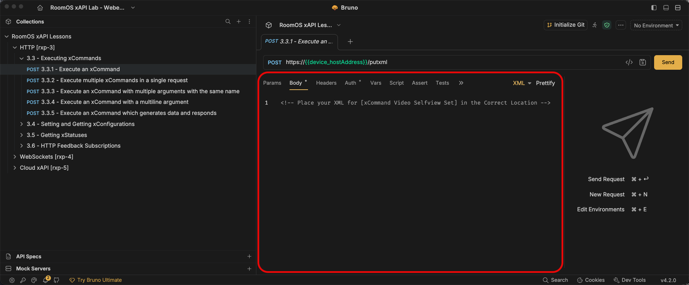
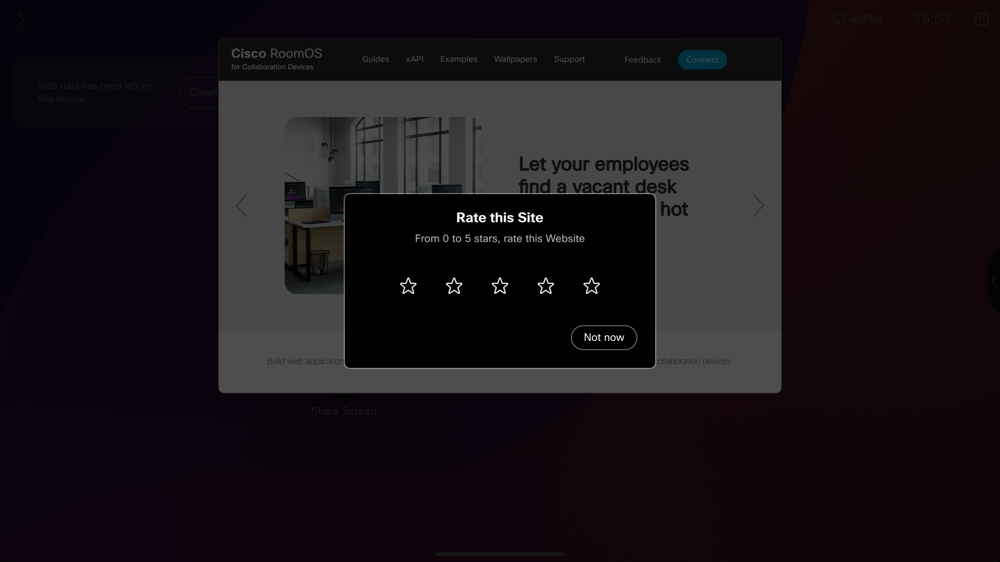
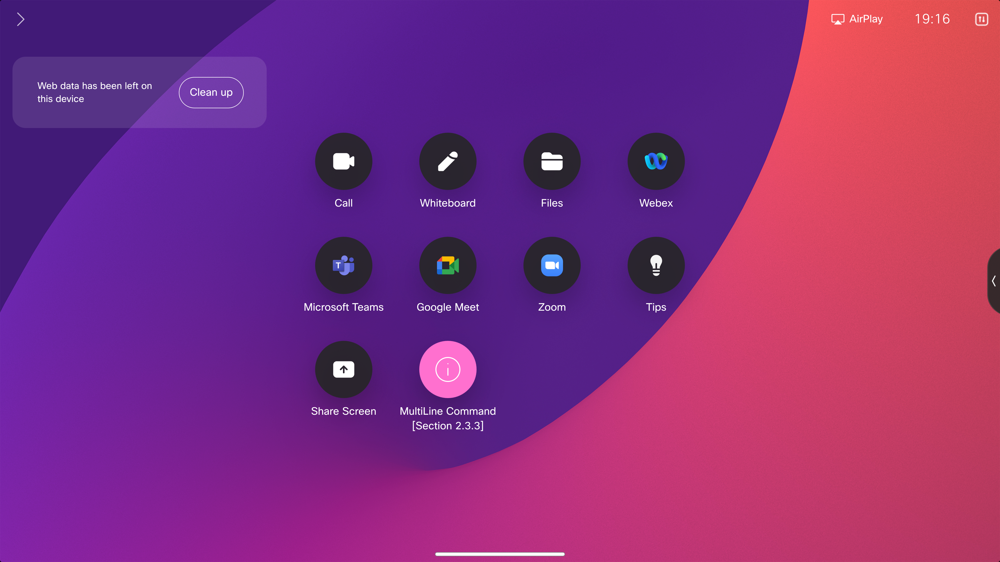
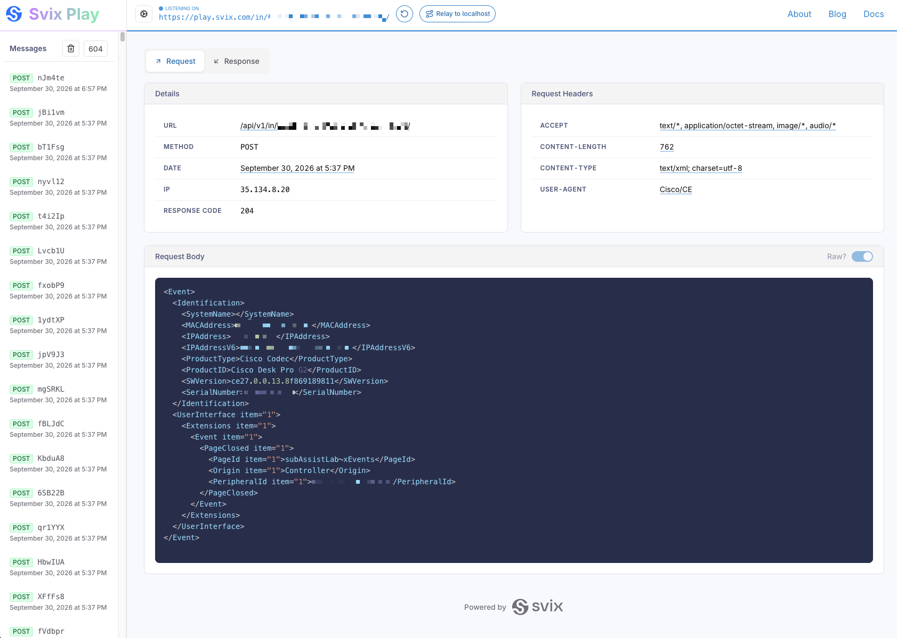

{{ config.cProps.devNotice }}
{{ config.cProps.acronyms }}

# Access RoomOS xAPI via HTTP ~(section\ {{config.cProps.rxp.sectionIds.http}})~

!!! abstract

    In this section, we'll dive into the various pieces of the RoomOS Device xAPI stack and how to make use of them in various ways over the Hypertext Transfer Protocol (HTTP) using local authentication on a Cisco RoomOS Device.

    Here, we'll see the relationships between HTTP and SSH on how to structure an xConfiguration, xCommand, xStatus and xEvents to a Cisco RoomOS device

    !!! curious "Click the Tabs Below to see how HTTP xAPI calls communicate"

        === "Get Requests [xStatuses/xConfigs]"

            ``` mermaid
            %%{init: {'theme':'dark'}}%%
            sequenceDiagram
              participant My Customization
              participant Target Codec
              My Customization->>+Target Codec: xStatus/xConfig Get Request
              Note over My Customization,Target Codec: If Device Online
              Target Codec->>- My Customization: Responds 200 OK
            ```

        === "Post Requests [xCommands/xConfigs]"

            ``` mermaid
            %%{init: {'theme':'dark'}}%%
            sequenceDiagram
              participant My Customization
              participant Target Codec
              My Customization->>+Target Codec: xCommand/xConfig Post Request
              Note over My Customization,Target Codec: If Device Online
              Target Codec->>- My Customization: Responds 200 OK
            ```

        === "Subscriptions [HttpFeedback]"

            ``` mermaid
            %%{init: {'theme':'dark'}}%%
            sequenceDiagram
              participant My Customization
              participant Target Codec
              activate Target Codec
              Note over My Customization, Target Codec: WebHook Offered by My Customization<br>Configured in Target Codec
              Target Codec -->>+ My Customization: Forwards Subscription Traffic
              Note over My Customization,Target Codec: On Subscription callBack from Target Codec
              deactivate Target Codec
              activate My Customization
              Target Codec->>+ My Customization: Ex. xEvent UserInterface Extension Panel Clicked (QuickDial)
              activate Target Codec
              My Customization->>+Target Codec: Responds with xCommand Dial Post Request
              deactivate My Customization
              Target Codec->>- My Customization: Responds 200 OK
            ```

## Section {{config.cProps.rxp.sectionIds.http}} Requirements

!!! important ""

    !!! important inline end

        This lab assumes you have access to a Cisco RoomOS Device that is already setup and ready for use. If your device is not registered and online, please do so before beginning

    **Required Learning**

    - SSH Section {{config.cProps.rxp.sectionIds.ssh}}

    **Hardware**

    - A Laptop
    - A Cisco Desk, Board or Room Series Device running the most recent On Premise or Cloud Stable software
        - <hl_0>Preferred Device:</hl_0> <hl_4>Cisco Desk Pro</hl_4>
        - A Touch Controller is required when working on a Room Series Device. 
            - Room navigator or 3rd part touch display
    - A minimum of 1 camera (Either Integrated or External)

    **Software**

    - Laptop
        - Applications: 
            - {{config.cProps.apiClientApplication}}
            - Chrome or Firefox
        - Section {{config.cProps.rxp.sectionIds.http}} {{config.cProps.apiClientApplication}} Collection
        - Site:
            - {{config.cProps.webhookClientSite}}

    - RoomOS Device
        - Admin Access to the device
        - RoomOS Version: Current On Premise or Cloud Stable release
        - Install [Subscription Assistant Macro](https://webexcc-sa.github.io/LAB-11197/Main-Lab/RoomOS/rxp_intro/)

## Section {{config.cProps.rxp.sectionIds.http}} Setup

!!! important "Bruno and WebHook Site"

    {{ apps.bruno.installation.http | indent(4) }}

    !!! tip "Before making HTTP requests"

        If you haven't entered your device host, username, and password in [Setup: Cache your lab credentials](../../Setup/stp_intro.md), then click **Update Lab Guide**. The host is inserted into the URL examples below. The Basic Authentication examples show sample values; use your device's credentials in your HTTP client.

## **HTTP Authentication and Format** ~({{config.cProps.rxp.sectionIds.http}}.1)~

!!! blank ""

    <h4>URL Structure ~({{config.cProps.rxp.sectionIds.http}}.1.1)~</h4>

    The request URL for your Codec will change depending on whether you're making a GET or POST request

    Click the tabs below to see an example of each URL structure

    !!! example ""

        === "GET URL"

            https://{{config.cProps.auth.roomosIp}}/<hl_0>getxml?location=[YOUR_XAPI_PATH_BODY]</hl_0>

        === "POST URL"

            https://{{config.cProps.auth.roomosIp}}/<hl_0>putxml</hl_0>


    - - -

    <h4>Authentication Format ~({{config.cProps.rxp.sectionIds.http}}.1.2)~</h4>

    When using HTTP to talk to a Cisco RoomOS Device locally, the device uses basic authentication to accept those requests. This authentication is formatted in base64 with it's username and password concatenated as a single string separated by a colon <hl_4>**:**</hl_4>

    !!! example "Click on the tabs below to see how a Username and Password transitions to an encoded base64 string"

        === "Device Credentials >"

            **Username**: <hl_0>admin</hl_0>
            <br>
            **Password**: <hl_7>admin1234</hl_7>

        === "Decoded String >"

            <hl_0>admin</hl_0><hl_4>**:**</hl_4><hl_7>admin1234</hl_7>
            <br>
            <br>

        === "Encoded Base64 String >"

            <hl_5>YWRtaW46YWRtaW4xMjM0</hl_5>
            <br>
            <br>

        === "Authorization Request Header"

            "Authorization": "Basic <hl_5>YWRtaW46YWRtaW4xMjM0</hl_5>"
            <br>
            <br>

    !!! tip "Leverage Your Language’s Built-In Tools"

        Many languages include built-in functions or standard-library tools for manipulating data. For example, Python and JavaScript can encode and decode text using Base64 for you

        !!! example ""

            === "JavaScript"

                ``` JavaScript
                const response = await fetch("https://example.com/api", {
                  method: "POST",
                  headers: {
                    Authorization: `Basic ${btoa("admin:admin1234")}`,
                  },
                  body: "hello",
                });

                console.log(response.status);
                ```

            === "Python"

                ``` Python
                import requests

                response = requests.post(
                    "https://example.com/api",
                    auth=("admin", "admin1234"),
                    data="hello",
                )

                print(response.status_code)
                ```

            === "Rust"

                ``` Rust
                use reqwest::blocking::Client;

                fn main() -> Result<(), Box<dyn std::error::Error>> {
                    let response = Client::new()
                        .post("https://example.com/api")
                        .basic_auth("admin", Some("admin1234"))
                        .body("hello")
                        .send()?;

                    println!("{}", response.status());
                    Ok(())
                }
                ```

    - - -

    <h4>Request Headers ~({{config.cProps.rxp.sectionIds.http}}.1.3)~</h4>

    HTTP Requests have a myriad of headers that could be used, and this is usually defined by the device or service you're communicating with. For Cisco RoomOS devices using local authentication, your requests will use the following headers

    | Key                         | Value                             |
    | :---------------------------| :---------------------------------|
    | `Content-Type`              | `text/xml`                        |
    | `Authorization`             | `Basic [YOUR_BASE64_ENCODED_AUTH]` |

    - - -

    <h4>GET Request Path Format ~({{config.cProps.rxp.sectionIds.http}}.1.4)~</h4>

    When retrieving xStatus or xConfiguration information, you'll perform an HTTP Get request.

    <div class="code-label" data-title="GET requests using HTTP will target this base url">
        <pre><code>https://<hl_5>{{config.cProps.auth.roomosIp}}</hl_5>/getxml</code></pre>
    </div>

    The xAPI path you want to target is then defined as a URL parameter

    The xAPI path is separated by a <hl_3>/</hl_3> and is placed behind the parameter <hl_5>?location=</hl_5> the prefix <hl_7>x</hl_7> is removed from the top level node of the xAPI Path

    !!! example ""

        === "xConfiguration Example"

            <div class="code-label" data-title="Shell xAPI Path">
              <pre><code>xConfiguration SystemUnit Name</code></pre>
            </div>


            <div class="code-label" data-title="URL with xAPI Path">
              <pre><code>https://<hl_5>{{config.cProps.auth.roomosIp}}</hl_5>/getxml?location\=<hl_1>Configuration</hl_1><hl_3>/</hl_3><hl_1>SystemUnit</hl_1><hl_3>/</hl_3><hl_1>Name</hl_1></code></pre>
            </div>

        === "xStatus Example"

            <div class="code-label" data-title="Shell xAPI Path">
              <pre><code>xStatus Logging ExtendedLogging Mode</code></pre>
            </div>


            <div class="code-label" data-title="URL with xAPI Path">
              <pre><code>https://<hl_5>{{config.cProps.auth.roomosIp}}</hl_5>/getxml?location\=<hl_1>Status</hl_1><hl_3>/</hl_3><hl_1>Logging</hl_1><hl_3>/</hl_3><hl_1>ExtendedLogging</hl_1><hl_3>/</hl_3><hl_1>Mode</hl_1></code></pre>
            </div>
    
    !!! info "Troubleshooting GET Requests"

        GET requests use the `location` parameter to select one xAPI path. If the response is empty or does not contain the value you expected:

        - Check that the path starts with `Configuration` or `Status`, as appropriate. Omit the leading `x` from the shell xAPI syntax.
        - Check the spelling and `/` separators in the path.
        - Confirm that the URL contains one `location` path.

        A GET request can return `200 OK` even when the path is wrong or missing. Check the XML response body to confirm the requested value was returned.

        If you do not receive an xAPI XML response, check that the device is reachable, the URL and protocol are correct, and the credentials are valid. An authentication failure returns `401 Unauthorized`.

    <h4>POST Request Body Format ~({{config.cProps.rxp.sectionIds.http}}.1.5)~</h4>

    When setting xConfigurations or running xCommand over HTTP, you’ll perform a POST Request. 

    <div class="code-label" data-title="POST requests using HTTP will target this base url">
        <pre><code>https://<hl_5>{{config.cProps.auth.roomosIp}}</hl_5>/putxml</code></pre>
    </div>

    The xAPI path you want to target is then defined in the body of the request

    The body is structured as XML and is formatted as a string. The entire xAPI path, parameters and any values are defined within this XML string.

    The xAPI path is separated by a <hl_3>opening and closing XML tags</hl_3>. The prefix <hl_7>x</hl_7> is removed from the top level node of the xAPI Path

    !!! example ""

        <div class="code-label" data-title="URL">
          <pre><code>https://<hl_5>{{config.cProps.auth.roomosIp}}</hl_5>/putxml</code></pre>
        </div>

        Click the tabs below to see an example xConfiguration and xCommand body structured as XML

        !!! important ""

            !!! warning "Keep Commands and Configurations in Separate Requests"

                A <hl_2>/putxml</hl_2> request can contain multiple commands or multiple configuration values, but the request <hl_7>**CANNOT**</hl_7> mix commands and configurations in a single payload. Send each type in its own request: use a <hl_4>Command</hl_4> root for commands or a <hl_5>Configuration</hl_5> root for configuration values.

            === "xCommand Example"

                <div class="code-label" data-title="Shell xAPI Path">
                  <pre><code>xCommand Cameras Background Get Image: value Size: value</code></pre>
                </div>

                <div class="code-label" data-title="XML Body Structure">
                  <pre><code><hl_3>&lt;</hl_3><hl_1>Command</hl_1><hl_3>&gt;</hl_3>
                  <hl_3>&lt;</hl_3><hl_1>Cameras</hl_1><hl_3>&gt;</hl_3>
                    <hl_3>&lt;</hl_3><hl_1>Background</hl_1><hl_3>&gt;</hl_3>
                      <hl_3>&lt;</hl_3><hl_1>Get</hl_1><hl_3>&gt;</hl_3>
                        <hl_3>&lt;</hl_3><hl_1>Image</hl_1><hl_3>&gt;</hl_3>User1<hl_3>&lt;/</hl_3><hl_1>Image</hl_1><hl_3>&gt;</hl_3>
                        <hl_3>&lt;</hl_3><hl_1>Size</hl_1><hl_3>&gt;</hl_3>Large<hl_3>&lt;/</hl_3><hl_1>Size</hl_1><hl_3>&gt;</hl_3>
                      <hl_3>&lt;/</hl_3><hl_1>Get</hl_1><hl_3>&gt;</hl_3>
                    <hl_3>&lt;/</hl_3><hl_1>Background</hl_1><hl_3>&gt;</hl_3>
                  <hl_3>&lt;/</hl_3><hl_1>Cameras</hl_1><hl_3>&gt;</hl_3>
                <hl_3>&lt;/</hl_3><hl_1>Command</hl_1><hl_3>&gt;</hl_3></code></pre>
                </div>

            === "xConfiguration Example"

                <div class="code-label" data-title="Shell xAPI Path">
                  <pre><code>xConfiguration Cameras Background Enabled: False</code></pre>
                </div>

                <div class="code-label" data-title="XML Body Structure">
                  <pre><code><hl_3>&lt;</hl_3><hl_1>Configuration</hl_1><hl_3>&gt;</hl_3>
                  <hl_3>&lt;</hl_3><hl_1>Cameras</hl_1><hl_3>&gt;</hl_3>
                    <hl_3>&lt;</hl_3><hl_1>Background</hl_1><hl_3>&gt;</hl_3>
                      <hl_3>&lt;</hl_3><hl_1>Enabled</hl_1><hl_3>&gt;</hl_3>False<hl_3>&lt;/</hl_3><hl_1>Enabled</hl_1><hl_3>&gt;</hl_3>
                    <hl_3>&lt;/</hl_3><hl_1>Background</hl_1><hl_3>&gt;</hl_3>
                  <hl_3>&lt;/</hl_3><hl_1>Cameras</hl_1><hl_3>&gt;</hl_3>
                <hl_3>&lt;/</hl_3><hl_1>Configuration</hl_1><hl_3>&gt;</hl_3></code></pre>
                </div>

    !!! info "Troubleshooting POST Requests"

        POST requests send XML to `/putxml`. If the response indicates an error or the device does not behave as expected:

        - Check that the XML is well formed and uses the correct root element: `Command` for xCommands or `Configuration` for xConfigurations.
        - Check that the elements follow the xAPI path and that required parameters and values are valid.
        - Read the XML response. Command results report their status; a configuration response should include `Success`.

        For multiline arguments that contain XML, follow the escaping guidance in the multiline command lesson.

        If you do not receive an xAPI XML response, check that the device is reachable, the URL and protocol are correct, and the credentials are valid. An authentication failure returns `401 Unauthorized`.

    - - -

    <h4>Full HTTP Get and Post examples ~({{config.cProps.rxp.sectionIds.http}}.1.6)~</h4>

    !!! important

        For reference only — no action is required. These examples show HTTP request patterns for RoomOS. You do not need to copy, run, or deploy them.

        ??? info "Click to view a Full Example of each written using the JavaScript Fetch API ~({{config.cProps.rxp.sectionIds.http}}.1.6.a)~"

            === "Get"

                ``` JavaScript
                const myHeaders = new Headers();
                myHeaders.append("Content-Type", "text/xml");
                myHeaders.append("Authorization", "Basic [YOUR_BASE64_ENCODED_AUTH]");

                const requestOptions = {
                  method: "GET",
                  headers: myHeaders,
                  redirect: "follow"
                };

                fetch("https://{{config.cProps.auth.roomosIp}}/getxml?location=Configuration/SystemUnit/Name", requestOptions)
                  .then((response) => response.text())
                  .then((result) => console.log(result))
                  .catch((error) => console.error(error));

                /* Below is the Response Body after making a Successful Request

                <?xml version="#"?>
                <Configuration product="Cisco Codec" version="RoomOS #.#.#.#" apiVersion="#">
                    <SystemUnit>
                        <Name valueSpaceRef="/Valuespace/STR_0_50_NoFilt"> My Device Name</Name>
                    </SystemUnit>
                </Configuration>
                */
                ```

            === "Post"

                ``` JavaScript
                const myHeaders = new Headers();
                myHeaders.append("Content-Type", "text/xml");
                myHeaders.append("Authorization", "Basic [YOUR_BASE64_ENCODED_AUTH]");

                const raw = "<Configuration><SystemUnit><Name>My New System Name</Name></SystemUnit></Configuration>";

                const requestOptions = {
                  method: "POST",
                  headers: myHeaders,
                  body: raw,
                  redirect: "follow"
                };

                fetch("https://{{config.cProps.auth.roomosIp}}/putxml", requestOptions)
                  .then((response) => response.text())
                  .then((result) => console.log(result))
                  .catch((error) => console.error(error));

                /* Below is the Response Body after making a Successful Request

                <?xml version="#"?>
                <Configuration>
                    <Success/>
                </Configuration>
                */
                ```
        ??? info "Click to view a Full Example of each written using the Macro Editor [ES6 JS] and your codec's HTTPClient xAPIs ~({{config.cProps.rxp.sectionIds.http}}.1.6.b)~"

            === "Get"

                ```javascript
                import xapi from 'xapi';

                const destinationIp = '{{config.cProps.auth.roomosIp}}';
                const headers = ['Content-Type: text/xml', `Authorization: Basic ${btoa('[YOUR_AUTH]')}`];


                async function getPath(path){
                  const destinationUrl = `https://${destinationIp}/getxml?location=${path}`;

                  try {
                    const request = await xapi.Command.HttpClient.Get({
                      Url: destinationUrl,
                      Header: headers,
                      AllowInsecureHTTPS: 'True'
                    })
                    console.debug(request);
                    return request
                  } catch (e) {
                    let err = {
                      Context: `Failed Get Request to [${destinationUrl}]`,
                      ...e
                    }
                    throw new Error(err)
                  }
                }

                getPath('Configuration/SystemUnit/Name');
                ```

            === "Post"

                ```javascript
                import xapi from 'xapi';

                const destinationIp = '{{config.cProps.auth.roomosIp}}';
                const headers = ['Content-Type: text/xml', `Authorization: Basic ${btoa('[YOUR_AUTH]')}`];


                async function setPath(body){
                  const destinationUrl = `https://${destinationIp}/putxml`;

                  try {
                    const request = await xapi.Command.HttpClient.Post({
                      Url: destinationUrl,
                      Header: headers,
                      AllowInsecureHTTPS: 'True'
                    }, body)
                    console.debug(request);
                    return request
                  } catch (e) {
                    let err = {
                      Context: `Failed Post Request to [${destinationUrl}]`,
                      ...e
                    }
                    throw new Error(err)
                  }
                }

                setPath('<Configuration><SystemUnit><Name>My New System Name</Name></SystemUnit></Configuration>');
                ```

            <a class="md-button md-button--primary" href="https://roomos.cisco.com/xapi/Command.HttpClient.Get/?search=HTTPClient" target="_blank" >
                  Learn more about <strong>Device HTTPClient xAPIs</strong> <i class="fa-solid fa-square-up-right"></i>
            </a>

            ??? curious ":thinking: Hey, what's up with that `...e` in your caught error?"

                Again, knowing you language has it's benefits

                `...` is called a ==Spread Operator== and it's very useful when playing with data in ES6 JS

                We're using it here to pass the original error the xAPI produced into an ==err== object as well as some context to help us troubleshoot our macro in the future.

                <a class="md-button md-button--primary" href="https://developer.mozilla.org/en-US/docs/Web/JavaScript/Reference/Operators/Spread_syntax" target="_blank" >
                      Learn more about <strong>Spread Operators</strong> <i class="fa-solid fa-square-up-right"></i>
                </a>


        ??? info "Click to view a Full Example of each written using the Python Requests API ~({{config.cProps.rxp.sectionIds.http}}.1.6.c)~"

            === "Get"

                ``` Python
                import requests

                url = "https://{{config.cProps.auth.roomosIp}}/getxml?location=Configuration/SystemUnit/Name"

                payload = ""
                headers = {
                  'Content-Type': 'text/xml',
                  'Authorization': 'Basic [YOUR_BASE64_ENCODED_AUTH]'
                }

                response = requests.request("GET", url, headers=headers, data=payload)

                print(response.text)

                # Below is the response body after a successful request

                # <?xml version="#"?>
                # <Configuration product="Cisco Codec" version="RoomOS #.#.#.#" apiVersion="#">
                #     <SystemUnit>
                #         <Name>My Device Name</Name>
                #     </SystemUnit>
                # </Configuration>
                ```

            === "Post"

                ``` Python
                import requests

                url = "https://{{config.cProps.auth.roomosIp}}/putxml"

                payload = "<Configuration><SystemUnit><Name>My New System Name</Name></SystemUnit></Configuration>"
                headers = {
                  'Content-Type': 'text/xml',
                  'Authorization': 'Basic [YOUR_BASE64_ENCODED_AUTH]'
                }

                response = requests.request("POST", url, headers=headers, data=payload)

                print(response.text)

                # Below is the Response Body after making a Successful Request

                # <?xml version="#"?>
                # <Configuration>
                #     <Success/>
                # </Configuration>
                ```

## **Import and Configure the {{config.cProps.apiClientApplication}} Collection** ~({{config.cProps.rxp.sectionIds.http}}.2)~

{{ apps.bruno.import.http }}

!!! info inline end "Values for the Bruno collection"

    Enter these submitted device details in the collection's Vars fields:

    - Host Address: <hl_1><copy>{{config.cProps.auth.roomosIp}}</copy></hl_1>
    - Username: <hl_0><copy>{{config.cProps.auth.roomosUser}}</copy></hl_0>
    - Password: <hl_7><copy>{{config.cProps.auth.roomosPass}}</copy></hl_7>

{{ apps.bruno.configure.http }}

## **Executing xCommands** ~({{config.cProps.rxp.sectionIds.http}}.3)~

!!! Abstract

    Throughout section {{config.cProps.rxp.sectionIds.http}}.3, you'll learn how to format and execute xCommands against the codec via HTTP.

    The techniques outlined here will correspond to methods needed for setting new xConfiguration Values in section {{config.cProps.rxp.sectionIds.http}}.4

???+ lesson "Lesson: Execute an xCommand ~({{config.cProps.rxp.sectionIds.http}}.3.1)~"

    !!! info inline end "XML Body Location"

        <figure markdown>
          { width="400" }
        </figure>

    - **xAPI(s):**
        - <hl_0>xCommand Video Selfview Set</hl_0>

    - **Task:** 
        - Format <hl_4>xCommand Video Selfview Set</hl_4> into XML
        - Place the newly formatted XML into the Body of the ==Execute an xCommand== request of the {{config.cProps.apiClientApplication}} HTTP {{config.cProps.rxp.sectionIds.http}} collection
        - Include the following Parameter(s) and Value(s)
            - Mode: On
            - FullScreenMode: On
            - OnMonitorRole: First
        - Save the collection
        - Select Send, review the response and observe any changes on your device 

    - - -

    ??? success "View properly formatted XML and Successful Response"

        <div class="grid cards" markdown>

        -   **XML Body Format**

            ---
            ``` { .xml }
            <Command>
              <Video>
                <Selfview>
                  <Set>
                    <Mode>On</Mode>
                    <FullScreenMode>On</FullScreenMode>
                    <OnMonitorRole>First</OnMonitorRole>
                  </Set>
                </Selfview>
              </Video>
            </Command>
            ```

        -   **Response**

            ---
            ``` { .xml }
            <?xml version="#"?>
            <Command>
              <SelfviewSetResult status="OK"/>
            </Command>
            ```

        </div>

??? lesson "Lesson: Execute multiple xCommands in a single request ~({{config.cProps.rxp.sectionIds.http}}.3.2)~"

    !!! info

        You can structure your XML to allow for multiple xAPI calls under a single Parent Path, in this case the Parent Path is xCommand

        So long as the paths you're running are placed within their appropriate Common Path Nodes, then they will be considered. Should those Common Path Nodes deviate, then you must structure the XML to match

        ??? example "View Single vs Multiple Command Structure"

            === "Single Command Structure"

                ``` xml
                <Command>
                  <Macros>
                    <Macro>
                      <Save>
                        <Name>value</Name>
                        <Overwrite>False</Overwrite>
                        <Transpile>False</Transpile>
                        <body>Raw data here...</body>
                      </Save>
                    </Macro>
                  </Macros>
                </Command>
                ```
            === "Multiple Command Structure"

                ``` xml
                <Command>
                  <Macros>
                    <Macro>
                      <Save>
                        <Name>value</Name>
                        <Overwrite>False</Overwrite>
                        <Transpile>False</Transpile>
                        <body>Raw data here...</body>
                      </Save>
                      <Activate>
                        <Name>value</Name>
                      </Activate>
                    </Macro>
                    <Runtime>
                      <Restart>
                      </Restart>
                    </Runtime>
                  </Macros>
                </Command>
                ```

    !!! note inline end
        The following xAPI(s) come pre-formatted in the request body. You must find the correct position for the final xAPI

        - <hl_0>xCommand UserInterface WebView Display</hl_0>
        - <hl_0>xCommand UserInterface Message Rating Display</hl_0> 

    - **xAPI(s):**
        - <hl_0>xCommand</hl_0> Video Selfview Set
        - <hl_0>xCommand UserInterface</hl_0> WebView Display
        - <hl_0>xCommand UserInterface</hl_0> Message Rating Display

    - **Task:** 
        - Format <hl_4>xCommand UserInterface Message Rating Display</hl_4> into XML
        - Place the newly formatted XML into the correct position within the Body of the ==Execute multiple xCommands in a single request== request of the {{config.cProps.apiClientApplication}} HTTP {{config.cProps.rxp.sectionIds.http}} collection
        - Include the following Parameter(s) and Value(s)
            - Title: Rate this Site
            - Text: From 0 to 5 stars, rate this Website
            - Duration: 45
        - Save the collection
        - Select Send, review the response and observe any changes on your device 

    ??? success "View Successful OSD Output"

        <figure markdown="span">
          { width="500" }
          <figcaption>What to expect on your OSD on a successful request</figcaption>
        </figure>

    ??? success "View properly formatted XML and Successful Response"

        <div class="grid cards" markdown>

        -   **XML Body Format**

            ---
            === "Message Rating Display XML"

                ``` { .xml }
                <Command>
                  <UserInterface>
                    <Message>
                      <Rating>
                        <Display>
                          <Title>Rate this Site</Title>
                          <Text>From 0 to 5 stars, rate this Website</Text>
                          <Duration>45</Duration>
                        </Display>
                      </Rating>
                    </Message>
                  </UserInterface>
                </Command>
                ```

            === "Full XML body"

                ``` { .xml }
                <Command>
                  <Video>
                    <Selfview>
                      <Set>
                        <Mode>Off</Mode>
                      </Set>
                    </Selfview>
                  </Video>
                  <UserInterface>
                    <WebView>
                      <Display>
                        <Mode>Modal</Mode>
                        <Url>https://roomos.cisco.com</Url>
                      </Display>
                    </WebView>
                    <!-- Message Rating Display Should Start Here -->
                    <Message>
                      <Rating>
                        <Display>
                          <Title>Rate this Site</Title>
                          <Text>From 0 to 5 stars, rate this Website</Text>
                          <Duration>45</Duration>
                        </Display>
                      </Rating>
                    </Message>
                    <!-- Message Rating Display Should End Here -->
                  </UserInterface>
                </Command>
                ```

        -   **Response**

            ---
            ``` { .xml }
            <?xml version="#"?>
            <Command>
              <SelfviewSetResult status="OK"/>
              <WebViewDisplayResult status="OK"/>
              <RatingDisplayResult status="OK"/>
            </Command>
            ```

        </div>

        

??? lesson "Lesson: Execute an xCommand with multiple arguments with the same name ~({{config.cProps.rxp.sectionIds.http}}.3.3)~"

    !!! info


        Some xCommands offer parameters that can receive multiple arguments with the same name.

        We can structure the XML payload this way by simply duplicating the parameter and add that into your XML body.

        ??? example "View Single vs Multiple Parameter Structure"

            !!! note inline end

                Not all xCommands allows multiple arguments, be sure to review the xAPI's documentation on roomos.cisco.com

            === "Single Parameter Structure"

                ``` xml
                <Command>
                  <Presentation>
                    <Start>
                      <ConnectorId>1</ConnectorId>
                    </Start>
                  </Presentation>
                </Command>
                ```
            === "Multiple Parameter Structure"

                ``` xml
                <Command>
                  <Presentation>
                    <Start>
                      <ConnectorId>1</ConnectorId>
                      <ConnectorId>2</ConnectorId>
                      <ConnectorId>3</ConnectorId>
                    </Start>
                  </Presentation>
                </Command>
                ```

    !!! note inline end
        The following xAPI(s) come pre-formatted in the request body and clean up the previous lesson's work. You must find the correct position for the final xAPI

        - <hl_0>xCommand UserInterface WebView Clear</hl_0>
        - <hl_0>xCommand UserInterface Message Rating Clear</hl_0>
        - <hl_0>xCommand Video Selfview Set</hl_0>

    - **xAPI(s):**
        - xCommand UserInterface WebView Clear
        - xCommand UserInterface Message Rating Clear
        - xCommand Video Selfview Set
        - xCommand Video Input SetMainVideoSource

    - **Task:** 
        - Format <hl_4>xCommand Video Input SetMainVideoSource</hl_4> into XML
        - Place the newly formatted XML into the correct position within the Body of the ==Execute an xCommand with multiple arguments with the same name== request of the {{config.cProps.apiClientApplication}} HTTP {{config.cProps.rxp.sectionIds.http}} collection
        - Include the following Parameter(s) and Value(s)
            - ConnectorId: 1
            - Layout: Prominent
        - Duplicate the following Parameter(s) and Value(s) once
            - ConnectorId: 1
            - Note: Typically we would not duplicate the same connector with the xAPI, but for the purposes of this lab, we will and prove out how this structured.
        - Save the collection
        - Select Send, review the response and observe any changes on your device

    ??? success "View Successful OSD Output"

        <figure markdown="span">
          
          <figcaption>What to expect on your OSD on a successful request</figcaption>
        </figure>

    ??? success "View properly formatted XML and Successful Response"

        <div class="grid cards" markdown>

        -   **XML Body Format**

            ---
            === "Message Rating Display XML"

                ``` { .xml }
                <Command>
                  <Video>
                    <Input>
                      <SetMainVideoSource>
                        <ConnectorId>1</ConnectorId>
                        <!-- Your Duplicate ConnectorId Parameter Should Start Here  -->
                        <ConnectorId>1</ConnectorId>
                        <!-- Your Duplicate ConnectorId Parameter Should End Here  -->
                        <Layout>Prominent</Layout>
                      </SetMainVideoSource>
                    </Input>
                  </Video>
                </Command>
                ```

            === "Full XML body"

                ``` { .xml }
                <Command>
                  <UserInterface>
                    <WebView>
                      <Clear></Clear>
                    </WebView>
                    <Message>
                      <Rating>
                        <Clear></Clear>
                      </Rating>
                    </Message>
                  </UserInterface>
                  <Video>
                    <Selfview>
                      <Set>
                        <Mode>On</Mode>
                        <FullScreenMode>On</FullScreenMode>
                        <OnMonitorRole>First</OnMonitorRole>
                      </Set>
                    </Selfview>
                    <Input>
                      <SetMainVideoSource>
                        <ConnectorId>1</ConnectorId>
                        <!-- Your Duplicate ConnectorId Parameter Should Start Here  -->
                        <ConnectorId>1</ConnectorId>
                        <!-- Your Duplicate ConnectorId Parameter Should End Here  -->
                        <Layout>Prominent</Layout>
                      </SetMainVideoSource>
                    </Input>
                  </Video>
                </Command>
                ```

          -   **Response**

              ---
              ``` { .xml }
              <?xml version="#"?>
              <Command>
                <WebViewClearResult status="OK"/>
                <RatingClearResult status="OK"/>
                <SelfviewSetResult status="OK"/>
                <InputSetMainVideoSourceResult status="OK"/>
              </Command>
              ```

        </div>

??? lesson "Lesson: Execute an xCommand with a multiline argument ~({{config.cProps.rxp.sectionIds.http}}.3.4)~"

    !!! info

        <hl_5>Multiline Arguments</hl_5> can be placed into the body of the XML as well. Multiline content is placed specifically inside a <hl_3>&lt;body&gt;</hl_3> tag, which isn't explicitly documented in the path of the xAPI.

        The structure of a Multiline argument should look similar to the following

        <div class="code-label" data-title="Example XML Structure with Multiline Argument">
          <pre><code>&lt;Parent&gt;
          &lt;Child&gt;
            &lt;ChildParameter&gt;Value&lt;/ChildParameter&gt;
            <hl_3>&lt;body&gt;</hl_3><hl_5>[MY_MULTILINE_ARGUMENT]</hl_5><hl_3>&lt;/body&gt;</hl_3>
          &lt;/Child&gt;
        &lt;/Parent&gt;</code></pre>
        </div>
      
    !!! note inline end
        The following xAPI(s) come pre-formatted in the request body. You must find the correct position for the final xAPI

        - <hl_0>xCommand Video Selfview Set</hl_0>
        - <hl_0>xCommand Video Input SetMainVideoSource</hl_0>

    - **xAPI(s):**
        - xCommand Video Selfview Set
        - xCommand Video Input SetMainVideoSource
        - xCommand UserInterface Extensions Panel Save

    - **Task:** 
        - Format <hl_4>xCommand UserInterface Extensions Panel Save</hl_4> into XML
        - Place the newly formatted XML into the correct position within the Body of the ==Execute an xCommand with a multiline argument== request of the {{config.cProps.apiClientApplication}} HTTP {{config.cProps.rxp.sectionIds.http}} collection
        - Include the following Parameter(s) and Value(s)
            - PanelId: wx1_lab_multilineCommand
            - body:
                ```{ .xml , title="Value for your <body> tag" }
                <Extensions>
                  <Panel>
                    <Order>1</Order>
                    <PanelId>wx1_lab_multilineCommand</PanelId>
                    <Location>HomeScreen</Location>
                    <Icon>Info</Icon>
                    <Color>#FF70CF</Color>
                    <Name>MultiLine Command [Section {{config.cProps.rxp.sectionIds.http}}.3]</Name>
                    <ActivityType>Custom</ActivityType>
                  </Panel>
                </Extensions>
                ```

                ???+ warning "Wrapping XML Around XML"

                    !!! note

                        Not all multiline arguments use XML. For example, <hl_0>xCommand Bookings Put</hl_0> uses a JSON string, while <hl_1>xCommand UserInterface Branding Upload</hl_1> uses a Base64-encoded string.

                        Data placed inside a `<body>` tag must be provided as a string. If that string contains XML, escape the inner XML tags before placing them in the body. 
                        
                        For example:
                        - replace `<` with `&lt;`
                        - replace `>` with `&gt;`

                    If the body argument contains unescaped XML, the endpoint may have trouble distinguishing the body’s XML value from the outer xAPI XML payload in the HTTP POST. This can cause an error.

                    Escape the XML in the body argument before sending it.

                    You can use **Stringify XML Body** on the Tools page to do this for you.

                    <a class="md-button md-button--primary" href="../../../Resources/res_tools/" target="_blank">
                      Open **Tools** <i class="fa-solid fa-gear"></i> Page <i class="fa-solid fa-square-up-right"></i>
                    </a>
        - Save the collection
        - Select Send, review the response and observe any changes on your device

    ??? success "View Successful OSD Output"

        <figure markdown="span">
          { width="500" }
          <figcaption>What to expect on your OSD on a successful request</figcaption>
        </figure>

    ??? success "View properly formatted XML and Successful Response"

        <div class="grid cards" markdown>

        -   **XML Body Format**

            ---
            === "UserInterface Extensions Panel Save XML"

                ``` { .xml }
                <Command>
                  <UserInterface>
                    <Extensions>
                      <Panel>
                        <Save>
                          <PanelId>wx1_lab_multilineCommand</PanelId>
                          <body>&lt;Extensions&gt; &lt;Panel&gt; &lt;Order&gt;1&lt;/Order&gt; &lt;PanelId&gt;wx1_lab_multilineCommand&lt;/PanelId&gt; &lt;Location&gt;HomeScreen&lt;/Location&gt; &lt;Icon&gt;Info&lt;/Icon&gt; &lt;Color&gt;#FF70CF&lt;/Color&gt; &lt;Name&gt;MultiLine Command [Section {{config.cProps.rxp.sectionIds.http}}.3]&lt;/Name&gt; &lt;ActivityType&gt;Custom&lt;/ActivityType&gt; &lt;/Panel&gt; &lt;/Extensions&gt;
                          </body>
                        </Save>
                      </Panel>
                    </Extensions>
                  </UserInterface>
                </Command>
                ```

            === "Full XML body"

                ``` { .xml }
                <Command>
                  <Video>
                    <Selfview>
                      <Set>
                        <Mode>Off</Mode>
                      </Set>
                    </Selfview>
                    <Input>
                      <SetMainVideoSource>
                        <ConnectorId>1</ConnectorId>
                        <Layout>Equal</Layout>
                      </SetMainVideoSource>
                    </Input>
                  </Video>
                  <!-- Your UserInterface Extensions Panel Save XML Should Start Here  -->
                  <UserInterface>
                    <Extensions>
                      <Panel>
                        <Save>
                          <PanelId>wx1_lab_multilineCommand</PanelId>
                          <body>&lt;Extensions&gt; &lt;Panel&gt; &lt;Order&gt;1&lt;/Order&gt; &lt;PanelId&gt;wx1_lab_multilineCommand&lt;/PanelId&gt; &lt;Location&gt;HomeScreen&lt;/Location&gt; &lt;Icon&gt;Info&lt;/Icon&gt; &lt;Color&gt;#FF70CF&lt;/Color&gt; &lt;Name&gt;MultiLine Command [Section {{config.cProps.rxp.sectionIds.http}}.3]&lt;/Name&gt; &lt;ActivityType&gt;Custom&lt;/ActivityType&gt; &lt;/Panel&gt; &lt;/Extensions&gt;
                          </body>
                        </Save>
                      </Panel>
                    </Extensions>
                  </UserInterface>
                  <!-- Your UserInterface Extensions Panel Save XML Should End Here  -->
                </Command>
                ```

          -   **Response**

              ---
              ``` { .xml }
              <?xml version="#"?>
              <Command>
                <SelfviewSetResult status="OK"/>
                <InputSetMainVideoSourceResult status="OK"/>
                <PanelSaveResult status="OK"/>
              </Command>
              ```

        </div>

??? lesson "Lesson: Execute an xCommand which generates data and responds ~({{config.cProps.rxp.sectionIds.http}}.3.5)~"

    !!! info

        Some commands will generate data and output a response. All commands will respond with an "OK" or "Error" but others can provide additional information.

        Whereas we made a UI extension with xCommand UserInterface Extensions Panel Save, we can now pull a list of our custom extensions using the xAPI

    !!! note inline end
        The following xAPI(s) will only produce information in the request response, you should not see a change on your device

    - **xAPI(s):**
        - <hl_0>xCommand UserInterface Extensions List</hl_0>

    - **Task:** 
        - Format <hl_4>xCommand UserInterface Extensions List</hl_4> into XML
        - Place the newly formatted XML into the correct position within the Body of the ==Execute an xCommand which generates data and responds== request of the {{config.cProps.apiClientApplication}} HTTP {{config.cProps.rxp.sectionIds.http}} collection
        - Include the following Parameter(s) and Value(s)
            - ActivityType: Custom
        - Save the collection
        - Select Send, review the response and observe any changes on your device

    ??? success "View properly formatted XML and Successful Response"

        <div class="grid cards" markdown>

        -   **XML Body Format**

            ``` { .xml }
            <Command>
              <UserInterface>
                <Extensions>
                  <List>
                    <ActivityType>Custom</ActivityType>
                  </List>
                </Extensions>
              </UserInterface>
            </Command>
            ```

          -   **Response**

              ---
              ``` { .xml }
              <?xml version="#"?>
              <Command>
                <ExtensionsListResult status="OK">
                  <Extensions>
                    <Version>1.11</Version>
                    <Panel item="1" maxOccurrence="n">
                      <Icon>Info</Icon>
                      <Location>HomeScreen</Location>
                      <ActivityType>Custom</ActivityType>
                      <Name>MultiLine Command [Section {{config.cProps.rxp.sectionIds.http}}.3]</Name>
                      <PanelId>wx1_lab_multilineCommand</PanelId>
                      <Origin>local</Origin>
                      <Order>1</Order>
                      <Color>#FF70CF</Color>
                      <Visibility>Auto</Visibility>
                    </Panel>
                  </Extensions>
                </ExtensionsListResult>
              </Command>
              ```
        </div>

## **Setting and Getting xConfigurations** ~({{config.cProps.rxp.sectionIds.http}}.4)~

!!! Abstract

    Throughout section {{config.cProps.rxp.sectionIds.http}}.4, you'll learn how to format, set and get xConfigurations against the codec via HTTP.

    The techniques outlined here will correspond to the methods needed for Getting xStatus Values in section {{config.cProps.rxp.sectionIds.http}}.5

???+ lesson "Lesson: Set a new xConfiguration Value ~({{config.cProps.rxp.sectionIds.http}}.4.1)~"

    !!! info inline end "XML Body Location"

        <figure markdown>
          { width="400" }
        </figure>

    - **xAPI(s):**
        - <hl_0>xConfiguration Audio DefaultVolume</hl_0>

    - **Task:**
        - Format <hl_4>xConfiguration Audio DefaultVolume</hl_4> into XML
        - Place the newly formatted XML into the Body of the ==Set a new xConfiguration Value== request of the {{config.cProps.apiClientApplication}} HTTP {{config.cProps.rxp.sectionIds.http}} collection
        - Include the following Parameter(s) and Value(s)
            - DefaultVolume: 75
        - Save the collection
        - Select Send and review the response

    - - -

    ??? success "View properly formatted XML and Successful Response"

        <div class="grid cards" markdown>

        -   **XML Body Format**

            ---
            ``` { .xml }
            <Configuration>
              <Audio>
                <DefaultVolume>75</DefaultVolume>
              </Audio>
            </Configuration>
            ```

        -   **Response**

            ---
            ``` { .xml }
            <?xml version="#"?>
            <Configuration>
              <Success/>
            </Configuration>
            ```

        </div>

??? lesson "Lesson: Set multiple xConfiguration Values in a single Request ~({{config.cProps.rxp.sectionIds.http}}.4.2)~"

    !!! note inline end

        The following xAPI(s) come pre-formatted in the request body. You must find the correct position for the final xAPI

        - <hl_0>xConfiguration Audio DefaultVolume</hl_0>

    - **xAPI(s):**
        - <hl_0>xConfiguration Audio DefaultVolume</hl_0>
        - <hl_0>xConfiguration SystemUnit Name</hl_0>

    - **Task:**
        - Format <hl_4>xConfiguration SystemUnit Name</hl_4> into XML
        - Place the newly formatted XML in the correct position within the Body of the ==Set multiple xConfiguration Values in a single Request== request of the {{config.cProps.apiClientApplication}} HTTP {{config.cProps.rxp.sectionIds.http}} collection
        - Include the following Parameter(s) and Value(s)
            - Name: Codec_<hl_3>X</hl_3>
                - Replace <hl_3>X</hl_3> with your workstation pod number or your name
        - Save the collection
        - Select Send and review the response

    ??? success "View properly formatted XML and Successful Response"

        <div class="grid cards" markdown>

        -   **XML Body Format**

            ---
            === "SystemUnit Name XML"

                ```xml
                <Configuration>
                  <SystemUnit>
                    <Name>Codec_X</Name>
                  </SystemUnit>
                </Configuration>
                ```

            === "Full XML body"

                ```xml
                <Configuration>
                  <Audio>
                    <DefaultVolume>50</DefaultVolume>
                  </Audio>
                  <!-- SystemUnit Name Should Start Here -->
                  <SystemUnit>
                    <Name>Codec_X</Name>
                  </SystemUnit>
                  <!-- SystemUnit Name Should End Here -->
                </Configuration>
                ```

        -   **Response**

            ---
            ```xml
            <?xml version="#"?>
            <Configuration>
              <Success/>
            </Configuration>
            ```

        </div>

??? lesson "Lesson: Getting an xConfiguration Value ~({{config.cProps.rxp.sectionIds.http}}.4.3)~"

    !!! info        

        In the previous lesson, you set the <hl_0>DefaultVolume</hl_0>. To retrieve that value, we'll use an HTTP GET request and put its xAPI path in the URL's <hl_5>location</hl_5> parameter. 
        
        As shown in section {{config.cProps.rxp.sectionIds.http}}.1.4, omit the <hl_7>x</hl_7> prefix from the shell syntax from the top-level node.

        ??? curious ":thinking: Can I used the `location` parameter more than once?"

            Unfortunately no, the location parameter will only be caught once in the URL. Duplicates after the fact will be ignored

            You can only define 1 path per GET request

    - **xAPI(s):**
        - <hl_0>xConfiguration Audio DefaultVolume</hl_0>

    - **Task:**
        - Format <hl_4>xConfiguration Audio DefaultVolume</hl_4> for the GET URL path
        - Place the path after <hl_5>?location=</hl_5> in the URL of the ==Getting an xConfiguration Value== request in the {{config.cProps.apiClientApplication}} HTTP {{config.cProps.rxp.sectionIds.http}} collection
        - Save the collection
        - Select Send and review the response

    ??? success "View properly formatted URL and Successful Response"

        <div class="code-label" data-title="Fully Formatted URL">
            <pre><code>https://{{device_hostAddress}}/getxml<hl_5>?location</hl_5>=<hl_4>Configuration/Audio/DefaultVolume</hl_4></code></pre>
        </div>

        <div class="code-label" data-title="Response">
          <pre><code>&lt;?xml version="#"?&gt;
        &lt;Configuration product="Cisco Codec" version="RoomOS #.#.#.#" apiVersion="#"&gt;
          &lt;Audio&gt;
            &lt;<hl_4>DefaultVolume</hl_4> valueSpaceRef="/Valuespace/INT_0_100"&gt;<hl_6>50</hl_6>&lt;/<hl_4>DefaultVolume</hl_4>&gt;
          &lt;/Audio&gt;
        &lt;/Configuration&gt;</code></pre>
        </div>

??? lesson "Lesson: Get multiple xConfiguration Values under a Common Node ~({{config.cProps.rxp.sectionIds.http}}.4.4)~"

    !!! info

        You can pull more information if you move up to a Common Node

        By removing <hl_7>DefaultVolume</hl_7> from the path of <hl_0>xConfiguration Audio </hl_0><hl_7>DefaultVolume</hl_7>, we can retrieve all xConfiguration values under the Audio Branch from the codec

    - **xAPI(s):**
        - <hl_0>xConfiguration Audio</hl_0>

    - **Task:**
        - Format <hl_4>xConfiguration Audio</hl_4> for the GET URL path
        - Place the path after <hl_5>?location=</hl_5> in the URL of the ==Getting multiple xConfiguration Values under a Common Node== request in the {{config.cProps.apiClientApplication}} HTTP {{config.cProps.rxp.sectionIds.http}} collection
        - Save the collection
        - Select Send and review the response

    ??? success "View properly formatted URL and Successful Response"

        <div class="code-label" data-title="Fully Formatted URL">
            <pre><code>https://{{device_hostAddress}}/getxml<hl_5>?location</hl_5>=<hl_4>Configuration/Audio</hl_4></code></pre>
        </div>

        <div class="code-label" data-title="Response">
          <pre><code>&lt;?xml version="#"?&gt;
        &lt;<hl_4>Configuration</hl_4> product="Cisco Codec" version="RoomOS #.#.#.#" apiVersion="#"&gt;
          &lt;<hl_4>Audio</hl_4>&gt;
            &lt;<hl_4>DefaultVolume</hl_4> valueSpaceRef="/Valuespace/INT_0_100"&gt;<hl_6>50</hl_6>&lt;/<hl_4>DefaultVolume</hl_4>&gt;
            &lt;<hl_4>Ethernet</hl_4>&gt;
              &lt;<hl_4>Encryption</hl_4> valueSpaceRef="/Valuespace/TTPAR_RequiredOptional"&gt;<hl_6>Required</hl_6>&lt;/<hl_4>Encryption</hl_4>&gt;
              &lt;<hl_4>SAPDiscovery</hl_4>&gt;
                &lt;<hl_4>Address</hl_4> valueSpaceRef="/Valuespace/STR_0_64_IPv4AdminMcast"&gt;<hl_6>239.255.255.255</hl_6>&lt;/<hl_4>Address</hl_4>&gt;
                &lt;<hl_4>Mode</hl_4> valueSpaceRef="/Valuespace/TTPAR_OnOff"&gt;<hl_6>Off</hl_6>&lt;/<hl_4>Mode</hl_4>&gt;
              &lt;/<hl_4>SAPDiscovery</hl_4>&gt;
            &lt;/<hl_4>Ethernet</hl_4>&gt;
            <hl_1>&lt;!-- Additional configuration values omitted for brevity --&gt;</hl_1>
          &lt;/<hl_4>Audio</hl_4>&gt;
        &lt;/<hl_4>Configuration</hl_4>&gt;</code></pre>
        </div>

??? curious ":thinking: What about subscribing to an xConfiguration, like with SSH?"

    Subscriptions via HTTP are possible, but require a process outside of using HTTP POST/GET commands. We'll need to leverage the HttpFeedback feature of the codec and a tool that can receive a WebHook event

    So we'll save HttpFeedback for the end of section {{config.cProps.rxp.sectionIds.http}} and handle all HTTP based subscriptions there

## **Getting xStatuses** ~({{config.cProps.rxp.sectionIds.http}}.5)~

!!! Abstract

    Throughout section {{config.cProps.rxp.sectionIds.http}}.5, you'll learn how to retrieve current xStatus values from the codec via HTTP.

    The GET request patterns from section {{config.cProps.rxp.sectionIds.http}}.4 apply here as well.

???+ lesson "Lesson: Getting an xStatus Value ~({{config.cProps.rxp.sectionIds.http}}.5.1)~"

    - **xAPI(s):**
        - <hl_0>xStatus Audio Volume</hl_0>

    - **Task:**
        - Format <hl_4>xStatus Audio Volume</hl_4> for the GET URL path
        - Place the path after <hl_5>?location=</hl_5> in the URL of the ==Getting an xStatus== request in the {{config.cProps.apiClientApplication}} HTTP {{config.cProps.rxp.sectionIds.http}} collection
        - Save the collection
        - Select Send and review the response

    ??? success "View properly formatted URL and Successful Response"

        <div class="code-label" data-title="Fully Formatted URL">
            <pre><code>https://{{device_hostAddress}}/getxml<hl_5>?location</hl_5>=<hl_4>Status/Audio/Volume</hl_4></code></pre>
        </div>

        <div class="code-label" data-title="Response">
          <pre><code>&lt;?xml version="#"?&gt;
        &lt;<hl_4>Status</hl_4> product="Cisco Codec" version="RoomOS #.#.#.#" apiVersion="#"&gt;
          &lt;<hl_4>Audio</hl_4>&gt;
            &lt;<hl_4>Volume</hl_4>&gt;<hl_6>65</hl_6>&lt;/<hl_4>Volume</hl_4>&gt;
          &lt;/<hl_4>Audio</hl_4>&gt;
        &lt;/<hl_4>Status</hl_4>&gt;</code></pre>
        </div>

??? lesson "Lesson: Get multiple xStatus Values under a Common Node ~({{config.cProps.rxp.sectionIds.http}}.5.2)~"

    - **xAPI(s):**
        - <hl_0>xStatus Audio</hl_0>

    - **Task:**
        - Format <hl_4>xStatus Audio</hl_4> for the GET URL path
        - Place the path after <hl_5>?location=</hl_5> in the URL of the ==Getting multiple xStatus Values under a Common Node== request in the {{config.cProps.apiClientApplication}} HTTP {{config.cProps.rxp.sectionIds.http}} collection
        - Save the collection
        - Select Send and review the response

    ??? success "View properly formatted URL and Successful Response"

        <div class="code-label" data-title="Fully Formatted URL">
            <pre><code>https://{{device_hostAddress}}/getxml<hl_5>?location</hl_5>=<hl_4>Status/Audio</hl_4></code></pre>
        </div>

        <div class="code-label" data-title="Response">
          <pre><code>&lt;?xml version="#"?&gt;
        &lt;<hl_4>Status</hl_4> product="Cisco Codec" version="RoomOS #.#.#.#" apiVersion="#"&gt;
          &lt;<hl_4>Audio</hl_4>&gt;
            &lt;<hl_4>Devices</hl_4>&gt;
              &lt;<hl_4>Bluetooth</hl_4>&gt;
                &lt;<hl_4>ActiveProfile</hl_4>&gt;<hl_6>None</hl_6>&lt;/<hl_4>ActiveProfile</hl_4>&gt;
              &lt;/<hl_4>Bluetooth</hl_4>&gt;
              &lt;<hl_4>HandsetUSB</hl_4>&gt;
                &lt;<hl_4>ConnectionStatus</hl_4>&gt;<hl_6>NotConnected</hl_6>&lt;/<hl_4>ConnectionStatus</hl_4>&gt;
                &lt;<hl_4>Cradle</hl_4>&gt;<hl_6>OnHook</hl_6>&lt;/<hl_4>Cradle</hl_4>&gt;
              &lt;/<hl_4>HandsetUSB</hl_4>&gt;
              &lt;<hl_4>HeadsetUSB</hl_4>&gt;
                &lt;<hl_4>ConnectionStatus</hl_4>&gt;<hl_6>NotConnected</hl_6>&lt;/<hl_4>ConnectionStatus</hl_4>&gt;
                &lt;<hl_4>Description</hl_4>&gt;&lt;/<hl_4>Description</hl_4>&gt;
                &lt;<hl_4>Manufacturer</hl_4>&gt;&lt;/<hl_4>Manufacturer</hl_4>&gt;
              &lt;/<hl_4>HeadsetUSB</hl_4>&gt;
              <hl_1>&lt;!-- Additional status values omitted for brevity --&gt;</hl_1>
            &lt;/<hl_4>Devices</hl_4>&gt;
          &lt;/<hl_4>Audio</hl_4>&gt;
        &lt;/<hl_4>Status</hl_4>&gt;</code></pre>
        </div>

## **HTTP Subscriptions using HttpFeedback xAPIs** ~({{config.cProps.rxp.sectionIds.http}}.6)~

!!! abstract "Before you begin"

    When using HttpFeedback in your environment, it's good to understand that this is set up per device. It's a tool in which the Codec registers a Webhook, provided by an external service, and allows the Codec to send information to that service.

    When working at scale, it's best to keep a template of your HttpFeedback commands to easily deploy this to your device when commissioned and for your teams internal documentation

    !!! important "Macros can Help!"

        Later in the lab, you'll work with Macros and they can help standardize unique combinations of xCommands, like HttpFeedback. xCommands are not backed up on the endpoint like xConfigurations are, so a macro can help simplify setup and can monitor your HttpFeedback too, allowing you to self repair in case the service was deregistered by mistake.

!!! blank ""

    <h3> **Understanding Feedback Registrations** ~({{config.cProps.rxp.sectionIds.http}}.6.1)~</h3>

    HttpFeedback has 4 FeedbackSlots total. Each can hold up to 15 Expressions, or xAPI paths.

    ??? curious "`60` expressions total!!! Isn't there `thousands` of xAPIs?!?"

        Yes, across the 4 feedback slots you can create up to 15 expressions per slot, but remember that you can use a Higher Common Node.

        With that, you could subscribe to all information on the Codec with just 3 paths, the highest paths

        - Configuration
        - Status
        - Event

        Depending on your use case, you may want to refine incoming information and make the service less chatty. It's best to only subscribe to what you need

    Each register can be sent to a different WebHook URL, or all can be pointed to the same URL

    Unlike SSH, setting up an HttpFeedback Registration, or HTTP based subscription, requires you to run another xCommand to apply this to the Codec.

    <roomosdoc>xCommand HttpFeedback Register</roomosdoc>

    xCommand HttpFeedback Register helps you point your subscription to the correct Webhook service

    Conversely, unsubscribing also needs an xCommand

    <roomosdoc>xCommand HttpFeedback Deregister</roomosdoc>

    - - -

    <h3> **xCommand HttpFeedback Register Parameters and Expression Format** ~({{config.cProps.rxp.sectionIds.http}}.6.2)~</h3>

    xCommand HttpFeedback Register has 4 Parameters

    ``` { .shell, .no-copy }
    xCommand HttpFeedback Register 
        Expression: <String 1 - 255 characters> 
        FeedbackSlot: <Number 1-4> 
        Format: <String: XML or JSON> 
        ServerUrl: <String 1 - 2048 characters>
    ```

    ??? info "Parameter Definitions"

        - Expression: The XPath expression specifies which parts of the Status, Configuration or Event XML documents are monitored. You can have from 0 to 15 XPath expressions in the same command.
          - You can declare this argument multiple times up to 15
        - FeedbackSlot <hl_4>(Required)</hl_4>: Location used to store your Feedback. Note: Avoid using FeedbackSlot 3 in an environment where Cisco TelePresence Management Suite (TMS) is used as TMS uses this feedbackslot to register its expressions.
        - Format: Set the format for the feedback from the HTTP server to XML or JSON.
        - ServerUrl <hl_4>(Required)</hl_4>: The URL to the HTTP server where you want the codec to post the HTTP feedback messages to.

    The <hl_0>Expression</hl_0> parameter requires you to format the xAPI similarly to how we structured the <hl_5>?location</hl_5> URL parameter for HTTP GET requests in earlier lessons.

    The xAPI path is separated by a <hl_3>/</hl_3> and is placed as the value for the <hl_0>Expression</hl_0> parameter. The prefix <hl_7>x</hl_7> is removed from the top level node of the xAPI Path.

    !!! example "Click the tabs below to see examples of the base Expression structure"

        === "xConfiguration Example"

            <div class="code-label" data-title="Shell xAPI Path">
              <pre><code>xFeedback Register Configuration/SystemUnit/Name</code></pre>
            </div>

            <div class="code-label" data-title="xAPI Integrated into Expression">
              <pre><code>xCommand HttpFeedback Register <hl_0>Expression</hl_0> : <hl_1>Configuration</hl_1><hl_3>/</hl_3><hl_1>SystemUnit</hl_1><hl_3>/</hl_3><hl_1>Name</hl_1> FeedbackSlot: 1 Format: JSON ServerUrl: [MY_WEBHOOK_ADDRESS]</code></pre>
            </div>

        === "xStatus Example"

            <div class="code-label" data-title="Shell xAPI Path">
              <pre><code>xFeedback Register Status/Logging/ExtendedLogging/Mode</code></pre>
            </div>

            <div class="code-label" data-title="xAPI Integrated into Expression">
              <pre><code>xCommand HttpFeedback Register <hl_0>Expression</hl_0> : <hl_1>Status</hl_1><hl_3>/</hl_3><hl_1>Logging</hl_1><hl_3>/</hl_3><hl_1>ExtendedLogging</hl_1><hl_3>/</hl_3><hl_1>Mode</hl_1> FeedbackSlot: 1 Format: JSON ServerUrl: [MY_WEBHOOK_ADDRESS]</code></pre>
            </div>

        === "xEvent Example"

            <div class="code-label" data-title="Shell xAPI Path">
              <pre><code>xFeedback Register Event/UserInterface/Assistant/Emit</code></pre>
            </div>

            <div class="code-label" data-title="xAPI Integrated into Expression">
              <pre><code>xCommand HttpFeedback Register <hl_0>Expression</hl_0> : <hl_1>Event</hl_1><hl_3>/</hl_3><hl_1>UserInterface</hl_1><hl_3>/</hl_3><hl_1>Assistant</hl_1><hl_3>/</hl_3><hl_1>Emit</hl_1> FeedbackSlot: 1 Format: JSON ServerUrl: [MY_WEBHOOK_ADDRESS]</code></pre>
            </div>

    - - -
    
    As noted before, we can register multiple expressions under a single FeedbackSlot as well as register to a Common Higher Node.

    !!! example "Click the tabs below to see more examples"

        === "Multiple Expression Example"

            <div class="code-label" data-title="Shell xAPI Path">
              <pre><code>xFeedback Register Configuration/Peripherals/InputDevice/Mode
            xFeedback Register Status/Video/Monitors
            xFeedback Register Event/WebRTC/ProviderCurrentDiagnosticsSend</code></pre>
            </div>

            <div class="code-label" data-title="xAPI Integrated into Expression">
              <pre><code>xCommand HttpFeedback Register <hl_0>Expression</hl_0> : <hl_1>Configuration</hl_1><hl_3>/</hl_3><hl_1>Peripherals</hl_1><hl_3>/</hl_3><hl_1>InputDevice</hl_1><hl_3>/</hl_3><hl_1>Mode</hl_1> <hl_0>Expression</hl_0> : <hl_1>Status</hl_1><hl_3>/</hl_3><hl_1>Video</hl_1><hl_3>/</hl_3><hl_1>Monitors</hl_1> <hl_0>Expression</hl_0> : <hl_1>Event</hl_1><hl_3>/</hl_3><hl_1>WebRTC</hl_1><hl_3>/</hl_3><hl_1>ProviderCurrentDiagnosticsSend</hl_1> FeedbackSlot: 1 Format: JSON ServerUrl: [MY_WEBHOOK_ADDRESS]</code></pre>
            </div>

        === "Higher Common Node example"
            
            <div class="code-label" data-title="Shell xAPI Path">
              <pre><code>xFeedback Register Configuration/Video</code></pre>
            </div>

            <div class="code-label" data-title="xAPI Integrated into Expression">
              <pre><code>xCommand HttpFeedback Register <hl_0>Expression</hl_0> : <hl_1>Configuration</hl_1><hl_3>/</hl_3><hl_1>Video</hl_1> FeedbackSlot: 1 Format: JSON ServerUrl: [MY_WEBHOOK_ADDRESS]</code></pre>
            </div>

        === "All xAPI Paths example"
            
            <div class="code-label" data-title="Shell xAPI Path">
              <pre><code>xFeedback Register Configuration
            xFeedback Register Status
            xFeedback Register Event</code></pre>
            </div>

            <div class="code-label" data-title="xAPI Integrated into Expression">
              <pre><code>xCommand HttpFeedback Register <hl_0>Expression</hl_0> : <hl_1>Configuration</hl_1> <hl_0>Expression</hl_0> : <hl_1>Status</hl_1> <hl_0>Expression</hl_0> : <hl_1>Event</hl_1> FeedbackSlot: 1 Format: JSON ServerUrl: [MY_WEBHOOK_ADDRESS]</code></pre>
            </div>

    When the registrations are complete, you'll start to see information poor into your service at the time your xAPI path generate a subscription event.

    Then your service can respond in kind based on the information received or even reach out to other services


      ``` mermaid
      %%{init: {'theme':'dark'}}%%
      sequenceDiagram
        participant Target Codec
        participant Webhook Service
        participant External as External Service<br/>[Ex: Email]
        Note over Target Codec,Webhook Service: Webhook URL is registered on the codec
        Target Codec-->>Webhook Service: HTTP POST: xEvent, xStatus, or xConfiguration update
        Webhook Service-->>Target Codec: HTTP 200 OK
        alt xStatus requires forward to external service
          Webhook Service->>External: Forward event or trigger action
          External-->>Webhook Service: External service responds
        end
        alt xEvent requires command response to Codec
          Webhook Service->>Target Codec: HTTP POST /putxml
        end
        Target Codec-->>Webhook Service: HTTP 200 OK with response
      ```

!!! warning 

    1. Re-running xCommand HttpFeedback Register over the  FeedbackSlot same slot, overrides the values in that slot. Be sure to review your existing expressions by running xStatus HttpFeedback before applying your feedback slot. Review it's contents and make sure not to break an active services you may be running for your device.

        <roomosfind>xStatus HttpFeedback</roomosfind>

        - - -

    2. Any malformed feedback expression will be ignored. The device will accept it, but since the path doesn't exist, the subscription won't fire. If you're not seeing your expression com in, then check your xAPI path(s)

## **Subscribing to xConfigurations, xStatuses and xEvents** ~({{config.cProps.rxp.sectionIds.http}}.7)~

!!! abstract

    Learn how to use RoomOS HttpFeedback to send selected xConfiguration, xStatus, and xEvent updates from a device to a webhook endpoint.
    
    You’ll register feedback with an HTTP(S) server, inspect the incoming data with {{config.cProps.webhookClientSite}}, and see how device events can trigger actions in an external application.

    !!! note

        In the following lessons, we'll continue to use HTTP to complete this section.

        However, setting up HttpFeedback doesn't require you to use HTTP POST or GET requests to apply them. You can set these feedbacks from any entry point where you can access the xAPI, such as SSH.

!!! important "Configure your Unique URL from {{config.cProps.webhookClientSite}}"

    {{ apps.bruno.configure.webhook.svix | indent(4) }}

    ??? question "View Example {{config.cProps.webhookClientSite}} output"

        <figure markdown>
          { width="600" }
        </figure>

???+ lesson "Lesson: Subscribing to an xConfiguration ~({{config.cProps.rxp.sectionIds.http}}.7.1)~" 

    - **xAPI(s):** 
        - <hl_0>xConfiguration Audio DefaultVolume</hl_0>

    - **Task:**
        - Format <hl_4>xConfiguration Audio DefaultVolume</hl_4> as an HttpFeedback Expression
        - Place the path within the <hl_6>Expression</hl_6> tags in the body of the <hl_0>Subscribing to an xConfiguration</hl_0> request in the {{config.cProps.apiClientApplication}} HTTP {{config.cProps.rxp.sectionIds.http}} collection
        - Save the collection and select Send
        - Press the <hl_5>Subscription Assistant Button</hl_5> on your Touch Interface
            - Under the xConfigurations Page, move the <hl_0>Audio DefaultVolume</hl_0> slider and release it
            - Observe the output on {{config.cProps.webhookClientSite}}
            - <hl_3>Optional</hl_3>: Move the slider again to generate more callbacks

    ??? success "View properly formatted Expression and XML Payload"

        <div class="grid cards" markdown>

        -   **Expression Format**

            ---

            ``` { .shell }
            Configuration/Audio/DefaultVolume
            ```

        -   **Full XML**

            ---
            ``` { .xml }
            <Command>
                <HttpFeedback>
                    <Register>
                        <!-- Place your structured between the <Expression> tags -->
                        <Expression>Configuration/Audio/DefaultVolume</Expression>
                        <!-- Do not alter the remaining parameters -->
                        <FeedbackSlot>1</FeedbackSlot>
                        <ServerUrl>{{Svix_Unique_URL}}</ServerUrl>
                    </Register>
                </HttpFeedback>
            </Command>
            ```

          </div>

!!! curious "What about Unsubscribing HTTFeedback?"

    HTTFeedback, as you saw, requires execution of a different xCommand to get started.

    Unsubscribing does the same thing, but with a deregister path. For brevity, we'll cover unsubscribing at the end of this section, as the xAPI expression is not needed in the deregistering process at all, so a dedicated lesson path is not needed.


??? lesson "Lesson: Subscribe to Multiple xConfigurations under a Common Node ~({{config.cProps.rxp.sectionIds.http}}.7.2)~" 

    - **xAPI(s):** 
        - <hl_0>xConfiguration Video Input AirPlay</hl_0>

    - **Task:**
        - Format <hl_4>xConfiguration Video Input AirPlay</hl_4> as an HttpFeedback Expression
        - Place the path within the <hl_6>Expression</hl_6> tags in the body of the <hl_0>Subscribe to Multiple xConfigurations under a Common Node</hl_0> request in the {{config.cProps.apiClientApplication}} HTTP {{config.cProps.rxp.sectionIds.http}} collection
        - Save the collection and select Send
        - Press the <hl_5>Subscription Assistant Button</hl_5> on your Touch Interface
            - Under the xConfigurations Page, change the buttons or toggles in the <hl_0>AirPlay</hl_0> row
            - Observe the output on {{config.cProps.webhookClientSite}}
            - <hl_3>Optional</hl_3>: Change additional AirPlay settings to generate more callbacks

    ??? success "View properly formatted Expression and XML Payload"

        <div class="grid cards" markdown>

        -   **Expression Format**

            ---

            ``` { .shell }
            Configuration/Video/Input/AirPlay
            ```

        -   **Full XML**

            ---
            ``` { .xml }
            <Command>
                <HttpFeedback>
                    <Register>
                        <!-- Place your structured between the <Expression> tags -->
                        <Expression>Configuration/Video/Input/AirPlay</Expression>
                        <!-- Do not alter the remaining parameters -->
                        <FeedbackSlot>1</FeedbackSlot>
                        <ServerUrl>{{Svix_Unique_URL}}</ServerUrl>
                    </Register>
                </HttpFeedback>
            </Command>
            ```

          </div>

??? lesson "Lesson: Subscribing to an xStatus ~({{config.cProps.rxp.sectionIds.http}}.7.3)~"

    - **xAPI(s):** 
        - <hl_0>xStatus Audio Volume</hl_0>

    - **Task:**
        - Format <hl_4>xStatus Audio Volume</hl_4> as an HttpFeedback Expression
        - Place the path within the <hl_6>Expression</hl_6> tags in the body of the <hl_0>Subscribing to an xStatus</hl_0> request in the {{config.cProps.apiClientApplication}} HTTP {{config.cProps.rxp.sectionIds.http}} collection
        - Save the collection and select Send
        - Press the <hl_5>Subscription Assistant Button</hl_5> on your Touch Interface
            - Under the xStatuses Page, move the <hl_0>Adjust Volume</hl_0> slider and release it
            - Alternatively, adjust the volume using the Codec's native volume controls
            - Observe the callback at {{config.cProps.webhookClientSite}}

    ??? success "View properly formatted Expression and XML Payload"

        <div class="grid cards" markdown>

        -   **Expression Format**

            ---

            ``` { .shell }
            Status/Audio/Volume
            ```

        -   **Full XML**

            ---
            ``` { .xml }
            <Command>
                <HttpFeedback>
                    <Register>
                        <!-- Place your structured between the <Expression> tags -->
                        <Expression>Status/Audio/Volume</Expression>
                        <!-- Do not alter the remaining parameters -->
                        <FeedbackSlot>2</FeedbackSlot>
                        <ServerUrl>{{Svix_Unique_URL}}</ServerUrl>
                    </Register>
                </HttpFeedback>
            </Command>
            ```

          </div>

??? lesson "Lesson: Subscribe to Multiple xStatuses under a Common Node ~({{config.cProps.rxp.sectionIds.http}}.7.4)~"

    - **xAPI(s):** 
        - <hl_0>xStatus Cameras Camera[n] Position</hl_0>

    - **Task:**
        - Format <hl_4>xStatus Cameras Camera[n] Position</hl_4> as an HttpFeedback Expression
        - Place the path within the <hl_6>Expression</hl_6> tags in the body of the <hl_0>Subscribe to Multiple xStatuses under a Common Node</hl_0> request in the {{config.cProps.apiClientApplication}} HTTP {{config.cProps.rxp.sectionIds.http}} collection
        - Save the collection and select Send
        - Press the <hl_5>Subscription Assistant Button</hl_5> on your Touch Interface
            - Under the xStatuses Page, use the button in the <hl_1>Camera Control Wheel</hl_1> row
                - Alternatively, move a camera using the native camera control interface
            - Observe the output on {{config.cProps.webhookClientSite}}

    ??? success "View properly formatted Expression and XML Payload"

        <div class="grid cards" markdown>

        -   **Expression Format**

            ---

            ``` { .shell }
            Status/Cameras/Camera/Position
            ```

        -   **Full XML**

            ---
            ``` { .xml }
            <Command>
                <HttpFeedback>
                    <Register>
                        <!-- Place your structured between the <Expression> tags -->
                        <Expression>Status/Cameras/Camera/Position</Expression>
                        <!-- Do not alter the remaining parameters -->
                        <FeedbackSlot>2</FeedbackSlot>
                        <ServerUrl>{{Svix_Unique_URL}}</ServerUrl>
                    </Register>
                </HttpFeedback>
            </Command>
            ```

          </div>

??? lesson "Lesson: Subscribing to an xEvent ~({{config.cProps.rxp.sectionIds.http}}.7.5)~"

    - **xAPI(s):** 
        - <hl_0>xEvent UserInterface Message Prompt Response</hl_0>

    - **Task:**
        - Format <hl_4>xEvent UserInterface Message Prompt Response</hl_4> as an HttpFeedback Expression
        - Place the path within the <hl_6>Expression</hl_6> tags in the body of the <hl_0>Subscribing to an xEvent</hl_0> request in the {{config.cProps.apiClientApplication}} HTTP {{config.cProps.rxp.sectionIds.http}} collection
        - Save the collection and select Send
        - Press the <hl_5>Subscription Assistant Button</hl_5> on your Touch Interface
            - Under the xEvents Page, press the <hl_1>Prompt</hl_1> button in the <hl_0>UserInterface Message</hl_0> row and choose an option
            - Observe the callback at {{config.cProps.webhookClientSite}}
            - <hl_3>Optional</hl_3>: Try the TextInput, Rating, or Alert buttons; Only the Prompt options should produce an event for this Prompt Response expression

    ??? success "View properly formatted Expression and XML Payload"

        <div class="grid cards" markdown>

        -   **Expression Format**

            ---

            ``` { .shell }
            Event/UserInterface/Message/Prompt/Response
            ```

        -   **Full XML**

            ---
            ``` { .xml }
            <Command>
                <HttpFeedback>
                    <Register>
                        <!-- Place your structured between the <Expression> tags -->
                        <Expression>Event/UserInterface/Message/Prompt/Response</Expression>
                        <!-- Do not alter the remaining parameters -->
                        <FeedbackSlot>3</FeedbackSlot>
                        <ServerUrl>{{Svix_Unique_URL}}</ServerUrl>
                    </Register>
                </HttpFeedback>
            </Command>
            ```

          </div>

??? lesson "Lesson: Subscribe to Multiple xEvents under a Common Node ~({{config.cProps.rxp.sectionIds.http}}.7.6)~"

    - **xAPI(s):** 
        - <hl_0>xEvent UserInterface</hl_0>

    - **Task:**
        - Format <hl_4>xEvent UserInterface</hl_4> as an HttpFeedback Expression
        - Place the path within the <hl_6>Expression</hl_6> tags in the body of the <hl_0>Subscribe to Multiple xEvents under a Common Node</hl_0> request in the {{config.cProps.apiClientApplication}} HTTP {{config.cProps.rxp.sectionIds.http}} collection
        - Save the collection and select Send
        - Press the <hl_5>Subscription Assistant Button</hl_5> on your Touch Interface
            - Under the xEvents Page, use any widget and complete its action
            - Observe the output on {{config.cProps.webhookClientSite}}
            - <hl_3>Optional</hl_3>: Try several widgets and compare their callbacks

    ??? success "View properly formatted Expression and XML Payload"

        <div class="grid cards" markdown>

        -   **Expression Format**

            ---

            ``` { .shell }
            Event/UserInterface
            ```

        -   **Full XML**

            ---
            ``` { .xml }
            <Command>
                <HttpFeedback>
                    <Register>
                        <!-- Place your structured between the <Expression> tags -->
                        <Expression>Event/UserInterface</Expression>
                        <!-- Do not alter the remaining parameters -->
                        <FeedbackSlot>3</FeedbackSlot>
                        <ServerUrl>{{Svix_Unique_URL}}</ServerUrl>
                    </Register>
                </HttpFeedback>
            </Command>
            ```

          </div>

??? lesson "Lesson: Register Multiple Feedback Expressions in a single Feedback Slot ~({{config.cProps.rxp.sectionIds.http}}.7.7)~"

    - **xAPI(s):** 
        - <hl_0>xConfiguration</hl_0>
        - <hl_0>xStatus</hl_0>
        - <hl_0>xEvent</hl_0>

    - **Task:** 
        - Format <hl_4>xConfiguration, xStatus and xEvent</hl_4> as an HttpFeedback Expressions each listed as a separate argument
        - Place each the path within their own <hl_6>Expression</hl_6> tags in the body of the <hl_0>Subscribe to Multiple xEvents under a Common Node</hl_0> request in the {{config.cProps.apiClientApplication}} HTTP {{config.cProps.rxp.sectionIds.http}} collection
        - Save the collection and select Send
        - You should start to see many events come into the endpoint, but you can also interact with element within the <hl_5>Subscription Assistant Button</hl_5> on your Touch Interface
            - Observe the output on {{config.cProps.webhookClientSite}}

    !!! warning ""

        From the [RoomOS API Guide](https://www.cisco.com/c/dam/en/us/td/docs/telepresence/endpoint/roomos-2602/api-reference-guide-roomos-2602.pdf):

        A device may give very much feedback, especially when calls are connected and disconnected. Do only subscribe to the feedback you need.

        Never register for all status feedback by issuing xFeedback register /Status. This may give the control application too much data to handle, which may lead to sluggish or unpredictable behavior.

        - - -

        We're registering all subscriptions purely for lab use, it's best only to subscribe for what you need or what your service is capable of.
        
    ??? success "View properly formatted Expression and XML Payload"

        <div class="grid cards" markdown>

        -   **Expression Format**

            ---

            ``` { .shell }
            Configuration
            Status
            Event
            ```

        -   **Full XML**

            ---
            ``` { .xml }
            <Command>
              <HttpFeedback>
                <Register>
                  <!-- Place your structured between the <Expression> tags -->
                  <Expression>Configuration</Expression>
                  <Expression>Status</Expression>
                  <Expression>Event</Expression>
                  <!-- Do not alter the remaining parameters -->
                  <FeedbackSlot>4</FeedbackSlot>
                  <ServerUrl>{{Svix_Unique_URL}}</ServerUrl>
                </Register>
              </HttpFeedback>
            </Command>
            ```

          </div>

??? lesson "Lesson: Deregister FeedbackSlots ~({{config.cProps.rxp.sectionIds.http}}.7.8)~" 

    - **xAPI(s):** 
      - <hl_0>xCommand HttpFeedback Deregister</hl_0>

    - **Task:**
        - The XML is pre-structured as the last item in your <hl_0> Deregister FeedbackSlots</hl_0> request in the {{config.cProps.apiClientApplication}} HTTP {{config.cProps.rxp.sectionIds.http}} collection
        - Review the XML
        - Select Send and events should stop coming into {{config.cProps.webhookClientSite}}

## **Section {{config.cProps.rxp.sectionIds.http}} Cleanup** ~({{config.cProps.rxp.sectionIds.http}}).8)~

{{config.cProps.rxp.sectionCleanup}}
