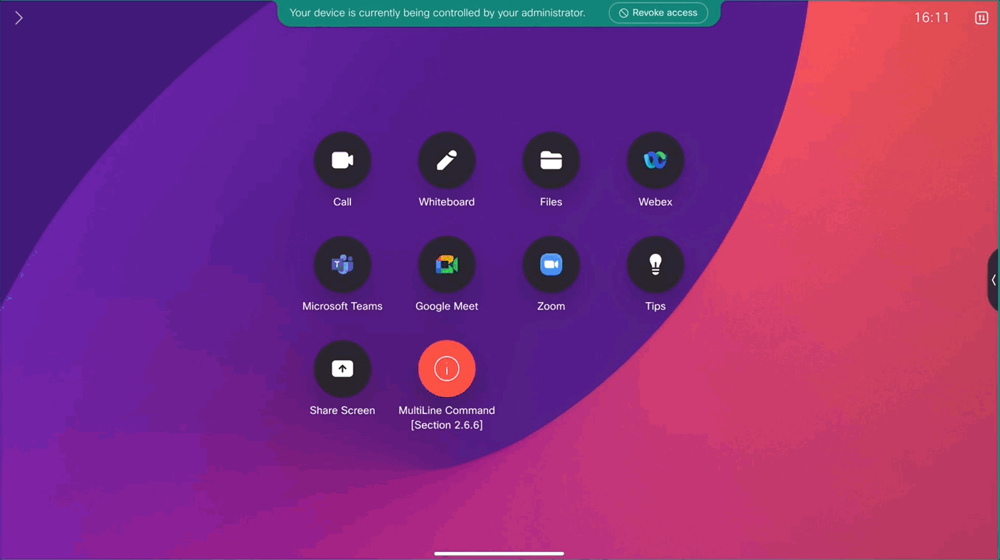

{{ config.cProps.devNotice }}
{{ config.cProps.acronyms }}

# Accessing the xAPI via the Macro Editor ~(section\ {{config.cProps.rxp.sectionIds.macro}})~

!!! abstract

    The Macro Editor is a <hl_1>Web Based IDE</hl_1> that's built into each Cisco Codec running <hl_6>ce9.2.X or higher (excluding the Sx10)</hl_6> that allows for the development of solutions using the <hl_0>Device xAPI and ES6 JavaScript</hl_0>. In a sense, the Macro Editor is like a virtual room control processor built right into the product.

    It's capable of running <hl_4>10 active macros</hl_4> at any given time and allows for storage of up to <hl_4>2mb of text across all files</hl_4> (Sounds small, but it's more than you think :smiley:).

    You may have as many inactive macros as you can contain with the 2mb limit, which can be useful for storing information, organizing and modularizing work.

    -  For example, some developers in the community have implemented function libraries formatted as a macro, such as 
        - <a href="https://github.com/cisco-ce/guido">Gui-Do</a>: A suite of functions that enables dynamic UI generation with the use of JSON Object
        - <a href="https://github.com/ctg-tme/Memory-Storage-Functions-V2">Memory Storage</a>: is a suite of function that enables persistent storage of custom object content. Great for information that needs to continue after a device boot or when the macro runtime restarts.
    
!!! important

    !!! example "Note"

        This section is meant to teach you to structure the xAPI as JavaScript when working the Macro Editor, <hl_7>but this is not a JavaScript tutorial</hl_7>. There are links to relevant JavaScript topics throughout the section in case you're stuck on any particular topic.

    Later in this lab under <hl_6>Solution Exercises > Macro Based Exercises</hl_6> you'll learn to leverage the Macro Editor and the UserInterface Extensions of your codec to develop a full solution.
    
<!-- 
    Syntax covered here is also relevant to the JSXAPI Node.js SDK, which is covered in JSXAPI ^{{ config.cProps.rxp.sectionIds.jsxapi }}^. 
    
-->

!!! important "Section Requirements"

    Download the MacroPak below, these Macros will be used throughout this section

    <div class="grid cards" markdown>

    -   <i class="fa-solid fa-download"></i> __Click the icon below to Download the MacroPak__ <i class="fa-solid fa-file-code"></i>

        ---

        <figure markdown="span">
              [{ width="200" }](https://github.com/WebexCC-SA/{{ config.cProps.labId }}/raw/refs/heads/main/docs/Main-Lab/DownloadContent/MacroPak/MacroPak2026.zip)
            <figcaption>MacroPak</figcaption>
        </figure>
    </div>

    **Required Learning**

    - SSH Section {{config.cProps.rxp.sectionIds.ssh}}

    **Hardware**

    - A Laptop
    - A Cisco Desk, Board or Room Series Device running the most recent On Premise or Cloud Stable software
        - <hl_0>Preferred Device:</hl_0> <hl_4>Cisco Desk Pro</hl_4>
        - A Touch Controller is required when working on a Room Series Device. 
            - Room navigator or 3rd part touch display
    - A minimum of 1 camera (Either Integrated or External)

    **Software**

    - Laptop
        - Applications: 
            - Chrome or Firefox
        - Section {{config.cProps.rxp.sectionIds.http}} {{config.cProps.apiClientApplication}} Collection

    - RoomOS Device
        - Admin Access to the device
        - RoomOS Version: Current On Premise or Cloud Stable release
        - Install [Subscription Assistant Macro](https://webexcc-sa.github.io/LAB-11197/Main-Lab/RoomOS/rxp_intro/)


## **Enabling Macros** ~({{config.cProps.rxp.sectionIds.macro}}.1)~

!!! blank ""

    - Login to your Codec's Web UI
        - Copy your device Host Address: <hl_4><copy>{{config.cProps.auth.roomosIp}}</copy></hl_4>
        - Enter this into a Web Browser as the URL
            - If your device does not have a cert installed, accept the self signed cert
        - Enter your devices
            - Username: <hl_1><copy>{{config.cProps.auth.roomosUser}}</copy></hl_1>
            - Password: <hl_7><copy>{{config.cProps.auth.roomosPass}}</copy></hl_7>
    - Select Macro Editor on the left side navigation interface
        - You may see an "Enable Macros" pop-up
        - If you do, enable it

    ???+ tip

        You can also enable the Macro Editor via the xAPI
        
        Running <hl_0>xConfiguration Macros Mode: On</hl_0> does the same thing.

        Knowing this, you can run this xConfigurations in bulk across your portfolio using Control Hub or Ce-Deploy, both are covered in later in this lab.

## **Get to know the Macro Editor and install the MacroPak** ~({{config.cProps.rxp.sectionIds.macro}}.2)~

The Macro Editor's user interface is based on the [Monaco Editor](https://microsoft.github.io/monaco-editor/). The very same editor found in popular IDE's such as Visual Studio code. If you're already familiar with Visual Studio, many of the same hot keys and tools are available, though no Plugins.

The Macro Editor is where you'll place your Macro code, edit and manage. But this is just the front. The underlying engine is called [QuickJS](https://quick.js.org/docs). This is what runs your Macro code against the codec.

Both the Monaco Editor and QuickJS have been tailored for RoomOS, so some things you may be familiar with in these platforms may not be available or altered.

Knowing the Front end and Back end is not only good for your edification, but is key to working alongside popular AI tools. If you and AI understand the environment, you can work more effectively.

!!! Tip "Fun Fact!"

    - In RoomOS 26.9.1 September 2026, the RoomOS engineering team added a new xStatus for us to understand the Macro Runtime a bit better.

    <roomosdoc>xStatus Macros JsEngineVersion</roomosdoc>

    > This xStatus shows the name and version of the JavaScript engine that the macro runtime is currently using.

??? vidcast "Vidcast: Macro Editor IDE Review"

    <div style="padding-bottom:56.25%; position:relative; display:block; width: 100%">
      <iframe src="https://app.vidcast.io/share/embed/d6dacbb3-9792-4d27-b1fa-434f2ff37f03" width="100%" height="100%" title="Macro Editor IDE Review" frameborder="0" loading="lazy" allowfullscreen style="position:absolute; top:0; left: 0;border: solid; border-radius:12px;"></iframe>
    </div>

??? vidcast "Vidcast: Installing the MacroPack"

    <div style="padding-bottom:56.25%; position:relative; display:block; width: 100%">
      <iframe src="https://app.vidcast.io/share/embed/f31a92e0-609d-430c-bb45-d834c52cb1d3" width="100%" height="100%" title="Installing MacroPak Files - WX1 2024 Lab 1451" frameborder="0" loading="lazy" allowfullscreen style="position:absolute; top:0; left: 0;border: solid; border-radius:12px;"></iframe>
    </div>

- - -

!!! important "Before you Begin"

    In addition to the Subscription Assistant, this section also leverages the MacroPak Manager UserInterface

    Since we have a limit to how many macros we can have active, and in an effort to keep the console clean and easy to read, the MacroPal Manager will endure only 1 Lesson Macro is active at a time.

    <hl_7>Do not activate or deactivate macros using the Macro Editor</hl_7>. The **MacroPak Manager will override your selection**, which may be the incorrect lesson macro.

    Please follow the instructions in each lesson below for guidance on using the MacroPak Manager.

- - -

## **Executing xCommands** ~({{config.cProps.rxp.sectionIds.macro}}.3)~

???+ lesson "Lesson: Execute an xCommand ~({{config.cProps.rxp.sectionIds.macro}}.3.1)~"

    !!! important inline end "The xapi import is `Import`ant!"

        Though the <hl_5>xapi</hl_5> object is automatically added to all new macros, it's important to understand you can't access the RoomOS xAPI without it.

        It's best to leave this at the top of your Macro. There are more advanced JS concepts that may allow removing this object, but those are not covered in this lab.

    All device xAPIs are referenced by the imported <hl_5>xapi</hl_5> object. By default, a new Macro will contain

    ``` { .JavaScript , title="xAPI Import" }
    import xapi from 'xapi';
    ```

    <a class="md-button md-button--primary" href="https://developer.mozilla.org/en-US/docs/Web/JavaScript/Reference/Statements/import" target="_blank" >
          Learn more about <strong>Imports</strong> <i class="fa-solid fa-square-up-right"></i>
    </a>

    Unlike other ES6 JavaScript environments, you only have access to base JavaScript functions and techniques as well as the device's xAPI. You're <hl_7>**NOT**</hl_7> able to import external libraries into this environment.
    
    - Though, you can define you're own imports via another macro.

    All xAPI are accessed by referencing the <hl_5>xapi</hl_5> object following by the same command path using dot notation

    !!! example "Click on the tabs to see how Terminal Syntax relates to Macro Syntax"

        === "Terminal Syntax"

            ``` shell
            xCommand Time DateTime Get

            OK
            *r DateTimeGetResult (status=OK): 
            *r DateTimeGetResult Day: 24
            *r DateTimeGetResult Hour: 0
            *r DateTimeGetResult Minute: 47
            *r DateTimeGetResult Month: 9
            *r DateTimeGetResult Second: 1
            *r DateTimeGetResult Year: 2024
            ** end
            ```

        === "Macro Syntax"

            ``` JavaScript
            import xapi from 'xapi';

            xapi.Command.Time.DateTime.Get().then(time => console.log(time))

            /* Log Output
            {
              "Day": "24",
              "Hour": "0",
              "Minute": "47",
              "Month": "9",
              "Second": "44",
              "Year": "2024",
              "status": "OK"
            }
            */
            ```

            ??? curious ":thinking: Why is `.then(time => console.log(time))` trailing the command?"

                Well that's the nature of a JavaScript environment. In a terminal session, the command is immediately followed by a response.

                Working in a Macro, or `jsxapi` NodeJs environment, the response is certainly there but we need to capture the response in an object and then log it to the console.

                Most, if not all, functions nested in the <hl_5>xapi</hl_5> object are JavaScript Promises. When executed, they'll either resolve or reject, similar to the OK or Error responses in SSH, and you can handle them as you see fit in your automation.

                <a class="md-button md-button--primary" href="https://developer.mozilla.org/en-US/docs/Web/JavaScript/Reference/Global_Objects/Promise" target="_blank" >
                      Learn more about <strong>Promises</strong> <i class="fa-solid fa-square-up-right"></i>
                </a>

                ??? tool "To get a bit more technical"

                    In the Example above, we first call the `xCommand Time DateTime Get` command. JS Promises can leverage the `.then()` method, which allows us to take that value of a successful outcome and store it into another object, in this case `time`, and when `time` is populated with a value, we can immediately run a function `=>` of this value to run additional processes. Here, we pass it into the in-built JS function; `console.log`, to log it into the Macro's log output.

                    If your function is rejected, then the `.catch()` method  can handle those outcomes in the same way `.then()` works on resolutions.

    ??? Tip "Understand function parameters as they relate to xCommands"

        xCommand arguments, or parameters, for Macro syntax are setup as a JSON Object and must be passed into a function as a funtion parameter.

        <a class="md-button md-button--primary" href="https://developer.mozilla.org/en-US/docs/Web/JavaScript/Reference/Global_Objects/JSON" target="_blank" >
          Learn more about <strong>JSON</strong> <i class="fa-solid fa-square-up-right"></i>
        </a>

        At a high level, functions defined in the <hl_5>xapi</hl_5> can have 1 or 2 JavaScript function parameters pass. 
        
        - The first function parameter for the <hl_5>xapi</hl_5> object are the xAPI xCommand arguments.
        - The second object is only used for multiline xCommand content.
            - NOTE: Not all xCommands have multiline content, so not all xCommands need 2 function parameters.

        !!! example " Click on the tabs below to see compare a generic JavaScript function definition and an xAPI xCOmmand declaration"

            === "Generic JavaScript function Definition"

                A function declaration is where we as developer define our own functions

                We're using this example to show you a very high level structure of what function parameters look like and what a promise looks like within a function. This should give you a glimpse of how the <hl_5>xapi</hl_5> object defines xAPI resolutions and rejections.

                ``` { .js , .no-copy }
                // Here we define the function
                // Number A is divided by Number B
                function divide_2_numbers(number_a, number_b){                  
                  return new Promise((resolve, reject) => {
                    if (number_b === 0){
                      reject('Can not divide by 0!');
                    }

                    resolve(number_a/number_b);
                  })
                }

                // Now we run the function

                divide_2_numbers(2, 2).then(resolution => {
                  console.log(resolution); Resolves: 1
                }).catch(e => {
                  console.error(e); // This does nothing due to Promise Resolution
                })

                divide_2_numbers(2, 0).then(resolution => {
                  console.log(resolution); // This does nothing due to Promise Rejection
                }).catch(e => {
                  console.error(e); // Rejects: 'Can not divide by 0!'
                });
                ```

            === "xAPI xCommand Declaration"

                In this example, we'll use a Mock xAPI with a branch of Parent, just to show how this is structured. 

                myChildParams serves as our xAPI's arguments

                myMultiLineContent serves as our xAPI's multiline content

                ``` { .js , .no-copy }
                // xAPI functions are already defined in this object
                import xapi from 'xapi';

                const myChildParams = { Parameter: 'One', Parameter: 2, Parameter: '...' };
                const myMultiLineContent= `...`;

                // Simply call the xAPI and add in it's function parameters
                xapi.Parent.Child(myChildParams, myMultiLineContent);
                ```

                <a class="md-button md-button--primary" href="https://developer.mozilla.org/en-US/docs/Web/JavaScript/Guide/Functions" target="_blank" >
                      Learn more about <strong>Functions</strong> <i class="fa-solid fa-square-up-right"></i>
                </a>

    - **xAPI:** 
        - <hl_0>xCommand Video Selfview Set</hl_0>

    {{config.cProps.macroPak.instructions | indent (4) }}

    - **Task:** 
        - Activate this Lesson Macro using the MacroPak Manager Button
        - Format the xAPI path above using Macro syntax and apply the following xAPI Parameters
            - Mode: On
            - FullscreenMode: On
            - OnMonitorRole: First
    
    - Save the lesson Macro
    - Monitor the Macro console and the OSD of your device for any changes
    
    ??? success "View Successful Macro Syntax"

        ??? curious "Why are there 3 answers?"

            To put it simply, because they are all correct.

            JavaScript has many ways for you to do similar work, which allows you to organize work the way you see fit as a developer.

            Click on each solution below and see how each differ from one another, but all achieve the same result.

        === "Simple Execution"

            This example is a bare bones execution of the xAPI.

            Nothing wring here, but it doesn't account for error handling or asynchronous execution

            ``` JavaScript

            import xapi from 'xapi';

            xapi.Command.Video.Selfview.Set({ Mode: "On", FullscreenMode: "On", OnMonitorRole: "First" });

            ```
          
        === "Promises > `.then()` Method"

            This example makes use of JavaScripts promise capabilities. Allows us to know when the xCommand resolved or when it was rejected, should there be an error. Finally just tells us it's done, no rejection or resolution coming here, we just need to know it's done

            ``` JavaScript

            import xapi from 'xapi';

            xapi.Command.Video.Selfview.Set({ Mode: "On", FullscreenMode: "On", OnMonitorRole: "First" }).then(resolution => {

              // Log the xAPI resolution
              console.log('Config.Video.Selfview.Set Resolution', resolution);

              /* Run Additional Function Here*/

            }).catch(error => {

              // Log the xAPI rejection
              console.error('Config.Video.Selfview.Set Error', error);

              /* Run Additional Function Here*/

            }).finally(() => {
              console.info('Config.Video.Selfview.Set Completed running regardless of state')

              /* Run Additional Function Here*/
            });
            ```

            <a class="md-button md-button--primary" href="https://developer.mozilla.org/en-US/docs/Web/JavaScript/Reference/Global_Objects/Promise" target="_blank" >
                  Learn more about <strong>Promises</strong> <i class="fa-solid fa-square-up-right"></i>
            </a>
        
        === "Promises > Async Await"

            Using async await, we can still reap the benefits of then, catch and finally, from promises, but we can be precise in the order in which we call our xAPI and group errors for multiple xAPI into 1 stack; improving readability.

            ``` JavaScript
            import xapi from 'xapi';

            const setSelfview = async function(parameters => {
              try {
                const runxAPI = await xapi.Command.Video.Selfview.Set(parameters);

                // Log the Resolution captured in a runxAPI object
                console.log(runxAPI);

                /* Run Additional Function Here*/

              } catch (error) (

                // Log the Rejection captured in a error object
                console.error(error);

                /* Run Additional Function Here*/

              );
            });

            // Run the setSelfview Function and pass in the Parameters for xCommand Video Selfview Set
            setSelfview({ Mode: "On", FullscreenMode: "On", OnMonitorRole: "First" });
            ```

            <a class="md-button md-button--primary" href="https://developer.mozilla.org/en-US/docs/Web/JavaScript/Reference/Statements/async_function" target="_blank" >
                  Learn more about <strong>Async Functions</strong> <i class="fa-solid fa-square-up-right"></i>
            </a>


??? lesson "Lesson: Execute an xCommand with multiple arguments with the same name ~({{config.cProps.rxp.sectionIds.macro}}.3.2)~"

    In cases where we need to declare multiple arguments of the same name, rather than duplicating and re-running the arguments as we did with SSH, we instead leverage JavaScript's Array capabilities

    <a class="md-button md-button--primary" href="https://developer.mozilla.org/en-US/docs/Web/JavaScript/Reference/Global_Objects/Array" target="_blank" >
      Learn more about <strong>Arrays</strong> <i class="fa-solid fa-square-up-right"></i>
    </a>

    !!! example "Click on the tabs to see how Terminal Syntax relates to Macro Syntax"

        === "Terminal Syntax"

            ``` { .shell }
            xParent Child ChildParam_X: 1, ChildParam_X: 2
            ```
            <br>

        === "Macro Syntax"

            ``` { .JavaScript }
            import xapi from 'xapi';

            xapi.Parent.Child({
              ChildChildParam_X: [1, 2] // Rather than calling ChildParam_X twice, we'll simply place both values we need into an Array
            })
            ```
    
    - **xAPI(s):** 
        - <hl_0>xCommand Video Selfview Set</hl_0>
        - <hl_0>xCommand Video Input SetMainVideoSource</hl_0>

    !!! note
        The following xAPI(s) come pre-formatted in the Macro. You must find the correct position for the final xAPI

        - <hl_0>xCommand Video Selfview Set</hl_0>

    {{config.cProps.macroPak.instructions | indent (4) }}

    - **Task:** 
        - Activate this Lesson Macro using the MacroPak Manager Button
        - Format <hl_4>xCommand Video Input SetMainVideoSource</hl_4> using Macro syntax and apply the following xAPI Parameters
            - ConnectorId: 1
            - Layout: Equal
        - Using an array, duplicate ConnectorId 1 and place it in the correct location
        - Save the lesson Macro
        - Monitor the Macro console and the OSD of your device for any changes

    ??? success "View Successful Macro Syntax"

        ``` JavaScript
        import xapi from 'xapi';

        const showAndComposeCamera = function () {
          xapi.Command.Video.Selfview.Set({ Mode: 'On', FullscreenMode: 'On', OnMonitorRole: 'First' });

          // Enter your solution below this line
          xapi.Command.Video.Input.SetMainVideoSource({
            ConnectorId: [1, 1],
            Layout: 'Equal'
          })
          // Don't go past this line
        }

        showAndComposeCamera();
        ```


??? lesson "Lesson: Execute an xCommand with a multiline arguments ~({{config.cProps.rxp.sectionIds.macro}}.3.3)~"

    !!! example "Click on the tabs to see how Terminal Syntax relates to Macro Syntax"

        === "Terminal Syntax"

            ``` {.shell, .no-copy}
            [Command Path]
            [Multi Line Content]
            .
            ```
            <br>

        === "Macro Syntax"

            ``` { .JavaScript }
            import xapi from 'xapi';

            const myChildParams = { Parameter_1: 'One', Parameter_2: 'Two', Parameter_X: '...' };
            const myMultiLineContent= `<XML_Parent>
              <XML_Child_1>
                <XML_Sub_Child_1>SubChild_Value</XML_Sub_Child_1>
              </XML_Child_1>
              <XML_Child_2>Child_2_Value</XML_Child_2>
            </XML_Parent>`;

            xapi.Parent.Child(myChildParams, myMultiLineContent);
            ```

    - **xAPI:** 
        - <hl_0>xCommand Video Selfview Set</hl_0>
        - <hl_0>xCommand Video Input SetMainVideoSource</hl_0>
        - <hl_0>xCommand UserInterface Extensions Panel Save</hl_0>

    {{config.cProps.macroPak.instructions | indent (4) }}

    - **Task:** 
        - Activate this Lesson Macro using the MacroPak Manager Button
        - Assign the value <hl_4>wx1_lab_multilineCommand</hl_4> to the <hl_1>myPanelId</hl_1> object as a string
        - Assign the following XML payload to the <hl_1>myUserinterfaceXML</hl_1> object as a multiline string
            ```xml
            <Extensions>
              <Panel>
                <Order>1</Order>
                <Location>HomeScreen</Location>
                <Icon>Info</Icon>
                <Color>#00FFFF</Color>
                <Name>MultiLine Command</Name>
                <ActivityType>Custom</ActivityType>
              </Panel>
            </Extensions>
            ```
        - Add the following to the <hl_5>buildUserInterface()</hl_5> function
            - Format <hl_4>xCommand UserInterface Extensions Panel Save</hl_4> using Macro syntax and apply the following xAPI Parameters
                - PanelId: Use the <hl_1>myPanelId</hl_1> object for this vale
                - body: Use the <hl_1>myUserinterfaceXML</hl_1> object for this value (Note: This is a MultiLine Argument)
    
    - Save the lesson Macro
    - Monitor the Macro console and the OSD of your device for any changes
  

    ??? success "View Successful Macro Syntax"

        ``` JavaScript
        import xapi from 'xapi';

        // Assign values to these Objects
        const myPanelId = 'wx1_lab_multilineCommand';

        const myUserinterfaceXML = `<Extensions>
              <Panel>
                <Order>1</Order>
                <PanelId>wx1_lab_multilineCommand</PanelId>
                <Location>HomeScreen</Location>
                <Icon>Info</Icon>
                <Color>#00FFFF</Color>
                <Name>MultiLine Command</Name>
                <ActivityType>Custom</ActivityType>
              </Panel>
            </Extensions>`


        const buildUserInterface = async function (){
          try {
            // Enter your solution below this line

            const saveUI = await xapi.Command.UserInterface.Extensions.Panel.Save({ PanelId: myPanelId }, myUserinterfaceXML)

            // Don't go past this line
            console.log(`Panel [${myPanelId}] saved to the codec`)
          } catch (e){
            console.error(e)
          }
        }


        async function cleanupLesson2(){
          await xapi.Command.Video.Selfview.Set({Mode: 'Off'});
          await xapi.Command.Video.Input.SetMainVideoSource({ConnectorId: 1, Layout: 'Equal'});
        }

        async function init(){
          await cleanupLesson2()

          await buildUserInterface();
        }

        init();
        ```

    ??? curious ":thinking: Having issues with saving Strings to Objects in your macro?"

        There are 3 ways to define string literals

        <div>
            <table>
              <thead>
                  <tr>
                      <th>Key</th>
                      <th>Name</th>
                      <th>Example</th>
                      <th>Extra Properties</th>
                  </tr>
              </thead>
              <tbody>
                  <tr>
                      <td>`'`</td>
                      <td style="white-space: nowrap;">Single Quote</td>
                      <td style="white-space: nowrap;"><code>const myString = "It's a sunny day.";</code></td>
                      <td>Can encapsulate a string with single quotes `'` inside</td>
                  </tr>
                  <tr>
                      <td>`"`</td>
                      <td style="white-space: nowrap;">Double Quote</td>
                      <td style="white-space: nowrap;"><code>const myOtherString = 'They said, "Hello!"';</code></td>
                      <td>Can encapsulate a string with double quotes `"` inside</td>
                  </tr>
                  <tr>
                      <td>`` ` ``</td>
                      <td style="white-space: nowrap;">Backtick Quote<br>SingleLine Example</td>
                      <td style="white-space: nowrap;"><code>const myBacktickString = \`They didn't say "World"\`;</code></td>
                      <td>Can encapsulate double and single quotes, allows for multiline strings, allows for string interpolation</td>
                  </tr>
                  <tr>
                      <td>`` ` ``</td>
                      <td style="white-space: nowrap;">Backtick Quote<br>MultiLine Example</td>
                      <td style="white-space: nowrap;"><code>const myMultiLineString = \`You know...<br>Not everyone needs to log Hello World to the console\`;</code></td>
                      <td>Your strings can be drafted as multiline within code, preserving their readability and any whitespace characters</td>
                  </tr>
                  <tr>
                      <td>`` ` ``</td>
                      <td style="white-space: nowrap;">Backtick Quote<br>Interpolation Example</td>
                      <td style="white-space: nowrap;"><code>const happyNow = 'Hello World';<br><br>const myFancyString = \`${happyNow}\`;</code></td>
                      <td>Using `${}` and placing a JavaScript object with the {} brackets, you can alter strings on the fly.</td>
                  </tr>
              </tbody>
          </table>
        </div>

        <a class="md-button md-button--primary" href="https://developer.mozilla.org/en-US/docs/Web/JavaScript/Reference/Global_Objects/String" target="_blank" >
          Learn more about <strong>Strings</strong> <i class="fa-solid fa-square-up-right"></i>
        </a>

??? lesson "Lesson: Execute an xCommand which generates data and responds ~({{config.cProps.rxp.sectionIds.macro}}.3.4)~"

    When collecting data from an xCommand in the Macro Editor, you either need to use the `.then()` method and log that value to the console or use an Async function to capture the value of that xCommand into a object, then log that object

    - **xAPI:** 
        - <hl_0>xCommand UserInterface Extensions List</hl_0>

    {{config.cProps.macroPak.instructions | indent (4) }}

    - **Task:** 
        - Activate this Lesson Macro using the MacroPak Manager Button
        - Format the xAPI above using Macro syntax and log it's response to the console using 1 of the 2 options below

        ??? example "Option 1"
            Capture the promise from <hl_4>xCommand UserInterface Extensions List</hl_4> using the <hl_5>.then()</hl_5> method, and log the value of the xAPI to the console
          
        ??? example "Option 2 [Preferred]"
            Declare an async function called <hl_1>checkExtensions</hl_1>, place <hl_4>xCommand UserInterface Extensions List</hl_4> within that function

            - Wrap your xAPI call in a <hl_6>Try Catch</hl_6> statement
            - Assign the value of the xAPI call to a new object
            - Then log the value of that new object to the console

    
    - Save the lesson Macro
    - Monitor the Macro console and the OSD of your device for any changes

    <div style="display: flex; gap: 10px;">
        <a class="md-button md-button--primary" href="https://developer.mozilla.org/en-US/docs/Web/JavaScript/Reference/Global_Objects/Promise" target="_blank">
            Learn more about <strong>Promises</strong> <i class="fa-solid fa-square-up-right"></i>
        </a>
        <a class="md-button md-button--primary" href="https://developer.mozilla.org/en-US/docs/Web/JavaScript/Reference/Statements/async_function" target="_blank">
            Learn more about <strong>Async Functions</strong> <i class="fa-solid fa-square-up-right"></i>
        </a>
    </div>
    
    ??? success "View Successful Macro Syntax"

        !!! important "Moving Forward"

            All future examples moving forward will only use <hl_4>Async Await</hl_4> syntax as a best practice. 
            
            If you're familiar with `.then()`, `.catch()` and `.finally()` syntax and prefer writing this way, feel free to do so. Comparing your answers to the lab will require you to understand <hl_4>Async Await</hl_4> in order to validate your answers.

        === "Using `.then()`"

            ```JavaScript
            import xapi from 'xapi';

            xapi.Command.UserInterface.Extensions.List().then(ext => {
              console.log(ext);
            }).catch(error => {
              console.error(error);
            });
            ```

        === "Using `Async Await`"

            ```JavaScript
            import xapi from 'xapi';
            
            const checkExtensions = async function () {

              try {
                const getExtensions = await xapi.Command.UserInterface.Extensions.List();
                console.log(getExtensions);
              } catch (error) {
                console.error(error);
              };
            };

            checkExtensions();
            ```

    

## **Setting, Getting and Subscribing to xConfigurations** ~({{config.cProps.rxp.sectionIds.macro}}.4)~

!!! Abstract

    Getting xConfiguration values, and later on xStatus Values, use the nearly same techniques for xCommands that generate data and respond.

    However, when <hl_0>Getting</hl_0> an xConfiguration or an xStatus, you'll need to add the <hl_4>.get()</hl_4> method at the end of the xAPI call.

    Subsequently, when <hl_0>Setting</hl_0> an xConfiguration, you'll need to add the <hl_7>.set()</hl_7> method at the end of the xAPI call. Note: You can not use <hl_7>.set()</hl_7> with an xStatus

    !!! example "Compare Macro Command vs Config syntax"

        === "xCommands"

            xapi.<hl_1>Command.ChildPath</hl_1><hl_6>(childParameter, childMultiLine)</hl_6>

        === "xConfigurations Get"

            xapi.<hl_1>Config.ChildPath</hl_1><hl_4>.get()</hl_4>

        === "xConfigurations Set"

            xapi.<hl_1>Config.ChildPath</hl_1><hl_7>.set('ChildValue')</hl_7>

???+ lesson "Lesson: Get an xConfiguration Value ~({{config.cProps.rxp.sectionIds.macro}}.4.1)~"

    - **xAPI:** 
        - <hl_0>xConfig Audio DefaultVolume</hl_0>

    {{config.cProps.macroPak.instructions | indent (4) }}

    - **Task:** 
        - Activate this Lesson Macro using the MacroPak Manager Button
        - Add the following to the <hl_5>getConfigValue()</hl_5> function
            - Format <hl_4>xConfig Audio DefaultVolume</hl_4> using Macro syntax and use the <hl_4>.get()</hl_4> method. Assign it to the <hl_1>targetConfig</hl_1> object
    
    - Save the lesson Macro
    - Monitor the Macro console and the OSD of your device for any changes

    ??? "View Successful Macro Syntax and Log output"

        === "Macro"

            ``` JavaScript
            import xapi from 'xapi';

            // Enter your solution below this line

            const getConfigValue = async function () {
              try {
                // Modify targetConfig below

                const targetConfig = await xapi.Config.Audio.DefaultVolume.get();

                // Don't go past this line
                console.log('DefaultVolume:', targetConfig)
              } catch (e) {
                console.error(e);
              };
            };

            getConfigValue();
            ```

        === "Log Output"

            | Timestamp | Source                                | Message                   |
            |-----------|---------------------------------------|---------------------------|
            | HH:MM:SS  | [system]                             | Runtime stopped!          |
            | HH:MM:SS  | [system]                             | Using XAPI transport: WebSocket |
            | HH:MM:SS  | [system]                             | Starting macros...        |
            | HH:MM:SS  | get-an-xconfiguration-value          | QJS Ready                 |
            | HH:MM:SS  | get-an-xconfiguration-value          | DefaultVolume: 75         |

??? lesson "Lesson: Set a new xConfiguration Value ~({{config.cProps.rxp.sectionIds.macro}}.4.2)~"

    - **xAPI:** 
        - <hl_0>xConfig Audio DefaultVolume</hl_0>

    {{config.cProps.macroPak.instructions | indent (4) }}

    - **Task:** 
        - Activate this Lesson Macro using the MacroPak Manager Button
        - Add the following to the <hl_5>setConfigValue()</hl_5> function
            - Format <hl_4>xConfig Audio DefaultVolume</hl_4> using Macro syntax and use the <hl_7>.set()</hl_7> method. Assign it to the <hl_1>targetConfig</hl_1> object
            - Pass the <hl_6>value</hl_6> function parameter the value for the <hl_7>.set()</hl_7>
        - Optional: 
            - In the <hl_5>setConfigValue()</hl_5> function, change the value of the <hl_5>setConfigValue()</hl_5> parameter to any value between 0 and 100.
                - Note: Leaving this blank will result default to 50
    
    - Save the lesson Macro
    - Monitor the Macro console and the OSD of your device for any changes

    ??? "View Successful Macro Syntax and Log output"

        === "Macro"

            ``` JavaScript
            import xapi from 'xapi';

            // Enter your solution below this line

            const setConfigValue = async function (value = 50) {
              try {
                // Modify targetConfig below

                const targetConfig = await xapi.Config.Audio.DefaultVolume.set(value);

                // Don't go past this line
                console.debug('DefaultVolume Set');
              } catch (e) {
                console.error(e);
              };
            };


            const getConfigValue = async function () {
              try {
                const targetConfig = await xapi.Config.Audio.DefaultVolume.get();
                console.log('DefaultVolume:', targetConfig);
              } catch (e) {
                console.error(e);
              };
            };

            async function init(){
              
              await setConfigValue(100); // <-- Change this Value [0-100] and Resave

              await getConfigValue();
            }

            init();
            ```

        === "Log Output"

            | Timestamp | Source                                | Message                   |
            |-----------|---------------------------------------|---------------------------|
            | HH:MM:SS  | [system]                             | Runtime stopped!          |
            | HH:MM:SS  | [system]                             | Using XAPI transport: WebSocket |
            | HH:MM:SS  | [system]                             | Starting macros...        |
            | HH:MM:SS  | set-a-new-xconfiguration-value   | QJS Ready                 |
            | HH:MM:SS  | set-a-new-xconfiguration-value   | DefaultVolume: [Some Value]         |

??? lesson "Lesson: Get multiple xConfigurations under a Common Node ~({{config.cProps.rxp.sectionIds.macro}}.4.3)~"

    - **xAPI:** 
        - <hl_0>xConfig Audio</hl_0>

    {{config.cProps.macroPak.instructions | indent (4) }}

    - **Task:** 
        - Activate this Lesson Macro using the MacroPak Manager Button
        - Add the following to the <hl_5>getConfigValue()</hl_5> function
            - Format <hl_4>xConfig Audio</hl_4> using Macro syntax and use the <hl_4>.get()</hl_4> method. Assign it to the <hl_1>targetConfig</hl_1> object
    
    - Save the lesson Macro
    - Monitor the Macro console and the OSD of your device for any changes

    ??? "View Successful Macro Syntax and Log output"

        === "Macro"

            ``` JavaScript
            import xapi from 'xapi';

            // Enter your solution below this line

            const getConfigValue = async function () {
              try {
                // Modify targetConfig below

                const targetConfig = await xapi.Config.Audio.get();

                // Don't go past this line
                console.log('DefaultVolume:', targetConfig)
              } catch (e) {
                console.error(e);
              };
            };

            getConfigValue();
            ```

        === "Log Output"

            | Timestamp | Source                                | Message                   |
            |-----------|---------------------------------------|---------------------------|
            | HH:MM:SS  | [system]                             | Runtime stopped!          |
            | HH:MM:SS  | [system]                             | Using XAPI transport: WebSocket |
            | HH:MM:SS  | [system]                             | Starting macros...        |
            | HH:MM:SS  | get-multiple-xconfigurations-under-a-common-node   | QJS Ready                 |
            | HH:MM:SS  | get-multiple-xconfigurations-under-a-common-node   | `{"DefaultVolume":"100","Ethernet":{"Encryption":"Required","SAPDiscovery":{"Address":"239.255.255.255","Mode":"Off"}},"Input":{"Ethernet":[{"Channel":[{"Gain":"45","Mode":"On","Pan":"Mono","Zone":"1","id":"1"},{"Gain":"45","Mode":"On","Pan":"Mono","Zone":"1","id":"2"},{"Gain":"45","Mode":"On","Pan":"Mono","Zone":"1","id":"3"},{"Gain":"45","Mode":"On","Pan":"Mono","Zone":"1","id":"4"},{"Gain":"45","Mode":"On","Pan":"Mono","Zone":"1","id":"5"},{"Gain":"45","Mode":"On","Pan":"Mono","Zone":"1","id":"6"},{"... And the list goes on"}],"EchoControl":{"Mode":"On","NoiseReduction":"On"},"Equalizer":{"ID":"1","Mode":"Off"},"Mode":"On","id":"1"}]}}{..."And the List Goes On"}`         |

??? lesson "Lesson: Subscribe and Unsubscribe to an xConfiguration ~({{config.cProps.rxp.sectionIds.macro}}.4.4)~"

    !!! info

        Subscriptions in the Macro Editor introduce another method we can append to the end of the path called <hl_2>.on()</hl_2>

        <hl_2>.on()</hl_2> allows us to subscribe to any changes in xConfigurations, xStatuses and xEvents until the script has either stopped or until the xAPI path is unsubscribed too

        <hl_2>.on()</hl_2> expects an object, similar to using `.then()` for you to place the incoming data. 
        
        Unlike the <hl_4>.get()</hl_4> method, the <hl_2>.on()</hl_2> method will not retrieve information as soon as it's called, but subscribes to it and will fire each time this subscriptions value changes.

        !!! example "Click on the tabs to see how Terminal Syntax relates to Macro Syntax"

            === "Terminal Syntax"

                ``` shell
                xFeedback Register Configuration/Child/Child
                ** end

                OK
                *c xConfiguration Child Child Value: 85
                ** end
                *c xConfiguration Child Child Value: 44
                ** end
                *c xConfiguration Child Child Value: 36
                ** end
                ```

            === "Macro Syntax"

                ``` JavaScript
                import xapi from 'xapi';

                xapi.Configuration.Child.Child.on(ChildValue => {
                  console.log('New ChildValue:', ChildValue);
                });

                /* Log Output
                New ChildValue: 85
                New ChildValue: 44
                New ChildValue: 36
                */
                ```

    - **xAPI:** 
        - <hl_0>xConfiguration Audio DefaultVolume</hl_0>

    {{config.cProps.macroPak.instructions | indent (4) }}

    - **Task:** 
        - **Disable all MacroPak macros by selecting the Stop button in the MacroPak Manager**
        - Modify the <hl_5>subscribeToDefaultVolume</hl_5> object
            - Format <hl_4>xConfiguration Audio DefaultVolume</hl_4> using Macro syntax and use the <hl_2>.on()</hl_2> method. Assign it to the <hl_1>subscribeToDefaultVolume</hl_1> object
            - Note: This macro is designed to randomly set the value of <hl_4>xConfiguration Audio DefaultVolume</hl_4> when enabled. It will unsubscribe from our xAPI in 10 seconds.
        - Activate this Lesson Macro using the MacroPak Manager Button

    - Save the lesson Macro
    - Monitor the Macro console and the OSD of your device for any changes

    - Review the contents of this Macro and take note of how we unsubscribe
        - Unsubscribing requires us to assign our xAPI path to an object
        - Calling this object as a function by appending <hl_0>()</hl_0>; the subscription will stop

    ??? success "View Successful Macro Syntax and Log output"

        === "Macro"

            ``` JavaScript
            import xapi from 'xapi';

            const delay_in_seconds = 10;

            // Edit this Object to include your xConfiguration Subscription
            const subscribeToDefaultVolume = xapi.Config.Audio.DefaultVolume.on(event => {
              console.log('DefaultVolume Set to:', event)
            })

            // Do not edit past this line, but feel free to review what's going on :)

            // Here, we use JS Timeouts to set an action to run after X seconds. Timeouts use milliseconds, hence why we multiply by 1000
            setTimeout(() => {

              subscribeToDefaultVolume(); //<-- By calling the Object we assigned our Subscription too as a function(), we will unsubscribe from it
              clearInterval(configInterval);

              console.warn("DefaultVolume Subscription stopped!");

            }, delay_in_seconds * 1000)


            // Here, we're randomly assigning a value between 1 and 100 to the Default Volume, so we can see that configuration on our Subscription
            function setRandomDefaultVolume() {
              const randomValue = Math.floor(Math.random() * 100) + 1;

              xapi.Config.Audio.DefaultVolume.set(randomValue);
            }


            // This countdown is used to help you visualize when the process will complete it's course
            // We use console.warn to have this countdown print in another color in the Macro Console
            function countdown(startNumber) {
              let currentNumber = startNumber;

              console.warn(`DefaultVolume Subscription stopping in [${currentNumber}] seconds`);

              const interval = setInterval(() => {
                currentNumber--;
                if (currentNumber > 0) {
                  console.warn(`DefaultVolume Subscription stopping in [${currentNumber}] seconds`);
                }

                if (currentNumber < 1) {
                  clearInterval(interval);
                }
              }, 1000);
            }

            function init() {
              configInterval = setInterval(() => {
                setRandomDefaultVolume();
              }, 500)

              countdown(delay_in_seconds);
            }

            init();
            ```

        === "Log Output"

            | Time       | Source                          | Message                                         |
            |------------|---------------------------------|-------------------------------------------------|
            | HH:MM:SS   | [system]                       | Runtime stopped!                               |
            | HH:MM:SS   | [system]                       | Using XAPI transport: WebSocket                |
            | HH:MM:SS   | [system]                       | Starting macros...                             |
            | HH:MM:SS   | subscribe-and-unsubscribe-to-an-xconfiguration| DefaultVolume Subscription stopping in [5] seconds |
            | HH:MM:SS   | subscribe-and-unsubscribe-to-an-xconfiguration| QJS Ready                                      |
            | HH:MM:SS   | subscribe-and-unsubscribe-to-an-xconfiguration| DefaultVolume Set to: 70                       |
            | HH:MM:SS   | subscribe-and-unsubscribe-to-an-xconfiguration| DefaultVolume Subscription stopping in [4] seconds |
            | HH:MM:SS   | subscribe-and-unsubscribe-to-an-xconfiguration| DefaultVolume Set to: 48                       |
            | HH:MM:SS   | subscribe-and-unsubscribe-to-an-xconfiguration| DefaultVolume Set to: 13                       |
            | HH:MM:SS   | subscribe-and-unsubscribe-to-an-xconfiguration| DefaultVolume Subscription stopping in [3] seconds |
            | HH:MM:SS   | subscribe-and-unsubscribe-to-an-xconfiguration| DefaultVolume Set to: 92                       |
            | HH:MM:SS   | subscribe-and-unsubscribe-to-an-xconfiguration| DefaultVolume Set to: 52                       |
            | HH:MM:SS   | subscribe-and-unsubscribe-to-an-xconfiguration| DefaultVolume Subscription stopping in [2] seconds |
            | HH:MM:SS   | subscribe-and-unsubscribe-to-an-xconfiguration| DefaultVolume Set to: 46                       |
            | HH:MM:SS   | subscribe-and-unsubscribe-to-an-xconfiguration| DefaultVolume Set to: 69                       |
            | HH:MM:SS   | subscribe-and-unsubscribe-to-an-xconfiguration| DefaultVolume Subscription stopping in [1] seconds |
            | HH:MM:SS   | subscribe-and-unsubscribe-to-an-xconfiguration| DefaultVolume Set to: 21                       |
            | HH:MM:SS   | subscribe-and-unsubscribe-to-an-xconfiguration| DefaultVolume Set to: 57                       |
            | HH:MM:SS   | subscribe-and-unsubscribe-to-an-xconfiguration| DefaultVolume Subscription stopped!             |

??? lesson "Lesson: Subscribe and Unsubscribe to Multiple xConfigurations under a Common Node ~({{config.cProps.rxp.sectionIds.macro}}.4.5)~"

    !!! info

        Just like we can subscribe to 1 point of interest in an xConfig branch, we can subscribe to a Higher Common Node as well

    - **xAPI:** 
        - <hl_0>xConfiguration Video Input AirPlay</hl_0>

    {{config.cProps.macroPak.instructions | indent (4) }}

    - **Task:** 
        - **Disable all MacroPak macros by selecting the Stop button in the MacroPak Manager**
        - Modify the <hl_5>subscribeToAirPlay</hl_5> object
            - Format <hl_4>xConfiguration Video Input AirPlay</hl_4> using Macro syntax and use the <hl_2>.on()</hl_2> method. Assign it to the <hl_1>subscribeToAirPlay</hl_1> object
            - Note: This macro is designed to randomly set the value of <hl_4>xConfiguration Video Input AirPlay</hl_4> when enabled. It will unsubscribe from our xAPI in 10 seconds.
        - Activate this Lesson Macro using the MacroPak Manager Button

    - Save the lesson Macro
    - Monitor the Macro console and the OSD of your device for any changes

    - Review the contents of this Macro and take note of how we unsubscribe
        - Unsubscribing requires us to assign our xAPI path to an object
        - Calling this object as a function by appending <hl_0>()</hl_0>; the subscription will stop

    ??? success "View Successful Macro Syntax and Log output"

        === "Macro"

            ``` JavaScript
            import xapi from 'xapi';

            const delay_in_seconds = 5;

            // Edit this Object to include your xConfiguration Subscription
            const subscribeToAirPlay = xapi.Config.Video.Input.AirPlay.on(event => {
              console.log('AirPlay Changes:', event)
            })

            // Do not edit past this line, but feel free to review what's going on :)

            // Here, we use JS Timeouts to set an action to run after X seconds. Timeouts use milliseconds, hence why we multiply by 1000
            setTimeout(() => {

              subscribeToAirPlay(); //<-- By calling the Object we assigned our Subscription too as a function(), we will unsubscribe from it

              console.warn("AirPlay Subscription stopped!");

            }, delay_in_seconds * 1000)


            // Here, we're randomly assigning a values to the AirPlay config, so we can see that configuration on our Subscription
            function setRandomAirPlayConfigs() {

              function randomNumber() {
                return Math.floor(Math.random() * 10);
              }

              const randomPass = `${randomNumber()}${randomNumber()}${randomNumber()}${randomNumber()}`

              xapi.Config.Video.Input.AirPlay.Mode.set(Math.random() < 0.5 ? "On" : "Off");

              xapi.Config.Video.Input.AirPlay.Beacon.set(Math.random() < 0.5 ? "Auto" : "Off");

              xapi.Config.Video.Input.AirPlay.Password.set(randomPass);
            }


            // This countdown is used to help you visualize when the process will complete it's course
            // We use console.warn to have this countdown print in another color in the Macro Console
            function countdown(startNumber) {
              let currentNumber = startNumber;

              console.warn(`AirPlay Subscription stopping in [${currentNumber}] seconds`);

              const interval = setInterval(() => {
                currentNumber--;
                if (currentNumber > 0) {
                  console.warn(`AirPlay Subscription stopping in [${currentNumber}] seconds`);
                }

                if (currentNumber < 1) {
                  clearInterval(interval);
                }
              }, 1000);
            }

            function init() {
              setInterval(() => {
                setRandomAirPlayConfigs();
              }, 500)

              countdown(delay_in_seconds);
            }

            init();
            ```

        === "Log Output"

            | Time       | Source                          | Message                                         |
            |------------|---------------------------------|-------------------------------------------------|
            | HH:MM:SS   | [system]                       | Runtime stopped!                               |
            | HH:MM:SS   | [system]                       | Using XAPI transport: WebSocket                |
            | HH:MM:SS   | [system]                       | Starting macros...                             |
            | HH:MM:SS   | subscribe-and-unsubscribe-to-multiple-xconfigurations-under-a-common-node | AirPlay Subscription stopping in [5] seconds   |
            | HH:MM:SS   | subscribe-and-unsubscribe-to-multiple-xconfigurations-under-a-common-node | QJS Ready                                      |
            | HH:MM:SS   | subscribe-and-unsubscribe-to-multiple-xconfigurations-under-a-common-node | AirPlay Changes: \{"Mode":"On"}                 |
            | HH:MM:SS   | subscribe-and-unsubscribe-to-multiple-xconfigurations-under-a-common-node | AirPlay Changes: \{"Beacon":"Off"}              |
            | HH:MM:SS   | subscribe-and-unsubscribe-to-multiple-xconfigurations-under-a-common-node | AirPlay Changes: \{"Password":"***"}            |
            | HH:MM:SS   | subscribe-and-unsubscribe-to-multiple-xconfigurations-under-a-common-node | AirPlay Subscription stopping in [4] seconds    |
            | HH:MM:SS   | subscribe-and-unsubscribe-to-multiple-xconfigurations-under-a-common-node | AirPlay Changes: \{"Mode":"Off"}                |
            | HH:MM:SS   | subscribe-and-unsubscribe-to-multiple-xconfigurations-under-a-common-node | AirPlay Changes: \{"Password":"***"}            |
            | HH:MM:SS   | subscribe-and-unsubscribe-to-multiple-xconfigurations-under-a-common-node | AirPlay Changes: \{"Mode":"On"}                 |
            | HH:MM:SS   | subscribe-and-unsubscribe-to-multiple-xconfigurations-under-a-common-node | AirPlay Changes: \{"Password":"***"}            |
            | HH:MM:SS   | subscribe-and-unsubscribe-to-multiple-xconfigurations-under-a-common-node | AirPlay Subscription stopping in [3] seconds    |
            | HH:MM:SS   | subscribe-and-unsubscribe-to-multiple-xconfigurations-under-a-common-node | AirPlay Changes: \{"Beacon":"Auto"}             |
            | HH:MM:SS   | subscribe-and-unsubscribe-to-multiple-xconfigurations-under-a-common-node | AirPlay Changes: \{"Password":"***"}            |
            | HH:MM:SS   | subscribe-and-unsubscribe-to-multiple-xconfigurations-under-a-common-node | AirPlay Changes: \{"Password":"***"}            |
            | HH:MM:SS   | subscribe-and-unsubscribe-to-multiple-xconfigurations-under-a-common-node | AirPlay Subscription stopping in [2] seconds    |
            | HH:MM:SS   | subscribe-and-unsubscribe-to-multiple-xconfigurations-under-a-common-node | AirPlay Changes: \{"Mode":"Off"}                |
            | HH:MM:SS   | subscribe-and-unsubscribe-to-multiple-xconfigurations-under-a-common-node | AirPlay Changes: \{"Beacon":"Off"}              |
            | HH:MM:SS   | subscribe-and-unsubscribe-to-multiple-xconfigurations-under-a-common-node | AirPlay Changes: \{"Password":"***"}            |
            | HH:MM:SS   | subscribe-and-unsubscribe-to-multiple-xconfigurations-under-a-common-node | AirPlay Changes: \{"Beacon":"Auto"}             |
            | HH:MM:SS   | subscribe-and-unsubscribe-to-multiple-xconfigurations-under-a-common-node | AirPlay Changes: \{"Password":"***"}            |
            | HH:MM:SS   | subscribe-and-unsubscribe-to-multiple-xconfigurations-under-a-common-node | AirPlay Subscription stopping in [1] seconds    |
            | HH:MM:SS   | subscribe-and-unsubscribe-to-multiple-xconfigurations-under-a-common-node | AirPlay Changes: \{"Mode":"On"}                 |
            | HH:MM:SS   | subscribe-and-unsubscribe-to-multiple-xconfigurations-under-a-common-node | AirPlay Changes: \{"Password":"***"}            |
            | HH:MM:SS   | subscribe-and-unsubscribe-to-multiple-xconfigurations-under-a-common-node | AirPlay Changes: \{"Mode":"Off"}                |
            | HH:MM:SS   | subscribe-and-unsubscribe-to-multiple-xconfigurations-under-a-common-node | AirPlay Changes: \{"Password":"***"}            |
            | HH:MM:SS   | subscribe-and-unsubscribe-to-multiple-xconfigurations-under-a-common-node | AirPlay Subscription stopped!                   |

<!-- ??? challenge "Challenge: Can you spot the Error?"

    In both the `xConfigs_Lesson-4_MacroPak_2-6-4` and `subscribe-and-unsubscribe-to-multiple-xconfigurations-under-a-common-node` macros, there is an error

    It's not an error in the syntax or format, but an error in the automation

    What do these macros continue to do if they are left active on a Codec that could be problematic?

    <a class="md-button md-button--primary" href="../challengeAnswers/" target="_blank" >
          Giving Up? Check out the Challenge Answers Page <i class="fa-solid fa-square-up-right"></i>
    </a> -->

## **Getting and Subscribing to xStatuses** ~({{config.cProps.rxp.sectionIds.macro}}.5)~

???+ lesson "Lesson: Get an xStatus Value ~({{config.cProps.rxp.sectionIds.macro}}.5.1)~"

    - **xAPI:**
        - <hl_0>xStatus Audio Volume</hl_0>

    {{config.cProps.macroPak.instructions | indent (4) }}

    - **Task:**
        - Activate this Lesson Macro using the MacroPak Manager Button
        - Add the following to the <hl_5>getStatusValue()</hl_5> function
            - Format <hl_4>xStatus Audio Volume</hl_4> using Macro syntax and use the <hl_4>.get()</hl_4> method. Assign it to the <hl_1>targetStatus</hl_1> object
    - Save the lesson Macro
    - Monitor the Macro console and the OSD of your device for any changes

    ??? "View Successful Macro Syntax and Log output"

        === "Macro"

            ``` JavaScript
            import xapi from 'xapi';

            // Enter your solution below this line

            const getStatusValue = async function () {
              try {
                // Modify targetStatus below

                const targetStatus = await xapi.Status.Audio.Volume.get();

                // Don't go past this line
                console.log('Volume:', targetStatus)
              } catch (e) {
                console.error(e);
              };
            };

            getStatusValue();
            ```

        === "Log Output"

            | Timestamp | Source                                | Message                   |
            |-----------|---------------------------------------|---------------------------|
            | HH:MM:SS  | [system]                             | Runtime stopped!          |
            | HH:MM:SS  | [system]                             | Using XAPI transport: WebSocket |
            | HH:MM:SS  | [system]                             | Starting macros...        |
            | HH:MM:SS  | get-an-xstatus-value   | QJS Ready                 |
            | HH:MM:SS  | get-an-xstatus-value   | Volume: 50         |

??? lesson "Lesson: Get multiple xStatuses under a Common Node ~({{config.cProps.rxp.sectionIds.macro}}.5.2)~"

    - **xAPI:**
        - <hl_0>xStatus Audio</hl_0>

    {{config.cProps.macroPak.instructions | indent (4) }}

    - **Task:**
        - Activate this Lesson Macro using the MacroPak Manager Button
        - Add the following to the <hl_5>getStatusValue()</hl_5> function
            - Format <hl_4>xStatus Audio</hl_4> using Macro syntax and use the <hl_4>.get()</hl_4> method. Assign it to the <hl_1>targetStatus</hl_1> object
    - Save the lesson Macro
    - Monitor the Macro console and the OSD of your device for any changes

    ??? "View Successful Macro Syntax and Log output"

        === "Macro"

            ``` JavaScript
            import xapi from 'xapi';

            // Enter your solution below this line

            const getStatusValue = async function () {
              try {
                // Modify targetStatus below

                const targetStatus = await xapi.Status.Audio.get();

                // Don't go past this line
                console.log(targetStatus)
              } catch (e) {
                console.error(e);
              };
            };

            getStatusValue();
            ```

        === "Log Output"

            | Timestamp | Source                                | Message                   |
            |-----------|---------------------------------------|---------------------------|
            | HH:MM:SS  | [system]                             | Runtime stopped!          |
            | HH:MM:SS  | [system]                             | Using XAPI transport: WebSocket |
            | HH:MM:SS  | [system]                             | Starting macros...        |
            | HH:MM:SS  | get-an-xstatus-value   | QJS Ready                 |
            | HH:MM:SS  | get-an-xstatus-value   | `{ "Devices": { "Bluetooth": { "ActiveProfile": "None" }, "HandsetUSB": { "ConnectionStatus": "NotConnected", "Cradle": "OnHook" }, "HeadsetUSB": { "ConnectionStatus": "NotConnected", "Description": "", "Manufacturer": "" } }, "Input": { "Connectors": { "HDMI": [ { "Mute": "On", "id": "1" } ], "Microphone": [ { "ConnectionStatus": "Connected", "id": "1" }, { "ConnectionStatus": "NotConnected", "id": "2" }, { "ConnectionStatus": "NotConnected", "id": "3" } ], "USBC": [ { "Mute": "On", "id": "1" } ] } } }{..."And the List Goes On"}`         |

??? lesson "Lesson: Subscribe and Unsubscribe to an xStatus ~({{config.cProps.rxp.sectionIds.macro}}.5.3)~"

    - **xAPI:**
        - <hl_0>xStatus Audio Volume</hl_0>

    {{config.cProps.macroPak.instructions | indent (4) }}

    - **Task:**
        - **Disable all MacroPak macros by selecting the Stop button in the MacroPak Manager**
        - Modify the <hl_1>subscribeToVolume</hl_1> object
            - Format <hl_4>xStatus Audio Volume</hl_4> using Macro syntax and use the <hl_2>.on()</hl_2> method. Assign it to the <hl_1>subscribeToVolume</hl_1> object
            - Note: This macro automatically unsubscribes after 10 seconds.
        - Activate this Lesson Macro using the MacroPak Manager Button
    - Save the lesson Macro
    - Raise and lower the volume on your Codec and monitor the Macro Console
        - If you missed the volume events, re-save the macro and perform this task within 10 seconds

    - Review the contents of this Macro and take note of how we unsubscribe
        - Unsubscribing requires us to assign our xAPI path to an object
        - Calling this object as a function by appending <hl_0>()</hl_0>; the subscription will stop

    ??? success "View Successful Macro Syntax and Log output"

        === "Macro"

            ``` JavaScript
            import xapi from 'xapi';

            const delay_in_seconds = 10;

            // Edit this Object to include your xStatus Subscription
            const subscribeToVolume = xapi.Status.Audio.Volume.on(vol => {
              console.log('Volume:', vol)
            });

            // Do not edit past this line, but feel free to review what's going on :)

            // Here, we use JS Timeouts to set an action to run after X seconds. Timeouts use milliseconds, hence why we multiply by 1000
            setTimeout(() => {

              subscribeToVolume(); //<-- By calling the Object we assigned our Subscription too as a function(), we will unsubscribe from it

              console.warn("Volume Subscription stopped!");

            }, delay_in_seconds * 1000)


            // This countdown is used to help you visualize when the process will complete it's course
            // We use console.warn to have this countdown print in another color in the Macro Console
            function countdown(startNumber) {
              let currentNumber = startNumber;

              console.warn(`Volume Subscription stopping in [${currentNumber}] seconds`);

              const interval = setInterval(() => {
                currentNumber--;
                if (currentNumber > 0) {
                  console.warn(`Volume Subscription stopping in [${currentNumber}] seconds`);
                }

                if (currentNumber < 1) {
                  clearInterval(interval);
                }
              }, 1000);
            }

            function init() {
              countdown(delay_in_seconds);
            }

            init();
            ```

        === "Log Output"

            | Time       | Source                                   | Message                                      |
            |------------|------------------------------------------|----------------------------------------------|
            | HH:MM:SS  | [system]                                 | Using XAPI transport: WebSocket              |
            | HH:MM:SS  | [system]                                 | Starting macros...                           |
            | HH:MM:SS  | subscribe-and-unsubscribe-to-an-xstatus      | Volume Subscription stopping in [10] seconds |
            | HH:MM:SS  | subscribe-and-unsubscribe-to-an-xstatus      | QJS Ready                                    |
            | HH:MM:SS  | subscribe-and-unsubscribe-to-an-xstatus      | Volume Subscription stopping in [9] seconds  |
            | HH:MM:SS  | subscribe-and-unsubscribe-to-an-xstatus      | Volume Subscription stopping in [8] seconds  |
            | HH:MM:SS  | subscribe-and-unsubscribe-to-an-xstatus      | Volume Subscription stopping in [7] seconds  |
            | HH:MM:SS  | subscribe-and-unsubscribe-to-an-xstatus      | Volume: 80                                   |
            | HH:MM:SS  | subscribe-and-unsubscribe-to-an-xstatus      | Volume: 85                                   |
            | HH:MM:SS  | subscribe-and-unsubscribe-to-an-xstatus      | Volume Subscription stopping in [6] seconds  |
            | HH:MM:SS  | subscribe-and-unsubscribe-to-an-xstatus      | Volume: 90                                   |
            | HH:MM:SS  | subscribe-and-unsubscribe-to-an-xstatus      | Volume Subscription stopping in [5] seconds  |
            | HH:MM:SS  | subscribe-and-unsubscribe-to-an-xstatus      | Volume: 85                                   |
            | HH:MM:SS  | subscribe-and-unsubscribe-to-an-xstatus      | Volume Subscription stopping in [4] seconds  |
            | HH:MM:SS  | subscribe-and-unsubscribe-to-an-xstatus      | Volume: 80                                   |
            | HH:MM:SS  | subscribe-and-unsubscribe-to-an-xstatus      | Volume Subscription stopping in [3] seconds  |
            | HH:MM:SS  | subscribe-and-unsubscribe-to-an-xstatus      | Volume: 75                                   |
            | HH:MM:SS  | subscribe-and-unsubscribe-to-an-xstatus      | Volume: 70                                   |
            | HH:MM:SS  | subscribe-and-unsubscribe-to-an-xstatus      | Volume Subscription stopping in [2] seconds  |
            | HH:MM:SS  | subscribe-and-unsubscribe-to-an-xstatus      | Volume: 65                                   |
            | HH:MM:SS  | subscribe-and-unsubscribe-to-an-xstatus      | Volume Subscription stopping in [1] seconds  |
            | HH:MM:SS  | subscribe-and-unsubscribe-to-an-xstatus      | Volume: 60                                   |
            | HH:MM:SS  | subscribe-and-unsubscribe-to-an-xstatus      | Volume Subscription stopped!                  |


??? lesson "Lesson: Subscribe and Unsubscribe to Multiple xStatuses under a Common Node ~({{config.cProps.rxp.sectionIds.macro}}.5.4)~"

    - **xAPI:**
        - <hl_0>xStatus Cameras Camera[N] Position</hl_0>

    {{config.cProps.macroPak.instructions | indent (4) }}

    - **Task:**
        - **Disable all MacroPak macros by selecting the Stop button in the MacroPak Manager**
        - Modify the <hl_1>subscribeToCameraPositions</hl_1> object
            - Format <hl_4>xStatus Cameras Camera[N] Position</hl_4> using Macro syntax and use the <hl_2>.on()</hl_2> method. Assign it to the <hl_1>subscribeToCameraPositions</hl_1> object
            - Note: This macro automatically unsubscribes after 10 seconds.
        - Activate this Lesson Macro using the MacroPak Manager Button
    - Save the lesson Macro
    - Perform the following steps
        - Open the Subscription Assistant
        - Select the xStatus Page
        - Then use the Control Wheel, Zoom In (+) and and Zoom out (-) buttons and observe your Macro Log output
        - If you missed the camera events, re-save the macro and perform this task within 10 seconds

    - Review the contents of this Macro and take note of how we unsubscribe
        - Unsubscribing requires us to assign our xAPI path to an object
        - Calling this object as a function by appending <hl_0>()</hl_0>; the subscription will stop

    ??? success "View Successful Macro Syntax and Log output"

        === "Macro"

            ``` JavaScript
            import xapi from 'xapi';

            const delay_in_seconds = 10;

            // Edit this Object to include your xStatus Subscription
            const subscribeToCameraPositions = xapi.Status.Cameras.Camera.Position.on(event => {
              console.log(event)
            });

            // Do not edit past this line, but feel free to review what's going on :)

            // Here, we use JS Timeouts to set an action to run after X seconds. Timeouts use milliseconds, hence why we multiply by 1000
            setTimeout(() => {

              subscribeToCameraPositions(); //<-- By calling the Object we assigned our Subscription too as a function(), we will unsubscribe from it

              console.warn("CameraPositions Subscription stopped!");

            }, delay_in_seconds * 1000)


            // This countdown is used to help you visualize when the process will complete it's course
            // We use console.warn to have this countdown print in another color in the Macro Console
            function countdown(startNumber) {
              let currentNumber = startNumber;

              console.warn(`CameraPositions Subscription stopping in [${currentNumber}] seconds`);

              const interval = setInterval(() => {
                currentNumber--;
                if (currentNumber > 0) {
                  console.warn(`CameraPositions Subscription stopping in [${currentNumber}] seconds`);
                }

                if (currentNumber < 1) {
                  clearInterval(interval);
                }
              }, 1000);
            }

            function init() {
              countdown(delay_in_seconds);
            }

            init();
            ```

        === "Log Output"

            | Time       | Source                                   | Message                                      |
            |------------|------------------------------------------|----------------------------------------------|
            | HH:MM:SS  | [system]                                 | Runtime stopped!                             |
            | HH:MM:SS  | [system]                                 | Using XAPI transport: WebSocket              |
            | HH:MM:SS  | [system]                                 | Starting macros...                           |
            | HH:MM:SS  | subscribe-and-unsubscribe-to-multiple-xstatuses-under-a-common-node      | CameraPositions Subscription stopping in [10] seconds |
            | HH:MM:SS  | subscribe-and-unsubscribe-to-multiple-xstatuses-under-a-common-node      | QJS Ready                                    |
            | HH:MM:SS  | subscribe-and-unsubscribe-to-multiple-xstatuses-under-a-common-node      | {"Zoom":"4295"}                             |
            | HH:MM:SS  | subscribe-and-unsubscribe-to-multiple-xstatuses-under-a-common-node      | CameraPositions Subscription stopping in [9] seconds  |
            | HH:MM:SS  | subscribe-and-unsubscribe-to-multiple-xstatuses-under-a-common-node      | {"Zoom":"5662"}                             |
            | HH:MM:SS  | subscribe-and-unsubscribe-to-multiple-xstatuses-under-a-common-node      | CameraPositions Subscription stopping in [8] seconds  |
            | HH:MM:SS  | subscribe-and-unsubscribe-to-multiple-xstatuses-under-a-common-node      | {"Pan":"-65"}                               |
            | HH:MM:SS  | subscribe-and-unsubscribe-to-multiple-xstatuses-under-a-common-node      | CameraPositions Subscription stopping in [7] seconds  |
            | HH:MM:SS  | subscribe-and-unsubscribe-to-multiple-xstatuses-under-a-common-node      | {"Pan":"-64","Tilt":"123"}                  |
            | HH:MM:SS  | subscribe-and-unsubscribe-to-multiple-xstatuses-under-a-common-node      | CameraPositions Subscription stopping in [6] seconds  |
            | HH:MM:SS  | subscribe-and-unsubscribe-to-multiple-xstatuses-under-a-common-node      | {"Pan":"-61","Tilt":"-20"}                  |
            | HH:MM:SS  | subscribe-and-unsubscribe-to-multiple-xstatuses-under-a-common-node      | {"Pan":"-24","Tilt":"-19"}                  |
            | HH:MM:SS  | subscribe-and-unsubscribe-to-multiple-xstatuses-under-a-common-node      | CameraPositions Subscription stopping in [5] seconds  |
            | HH:MM:SS  | subscribe-and-unsubscribe-to-multiple-xstatuses-under-a-common-node      | {"Tilt":"47"}                               |
            | HH:MM:SS  | subscribe-and-unsubscribe-to-multiple-xstatuses-under-a-common-node      | CameraPositions Subscription stopping in [4] seconds  |
            | HH:MM:SS  | subscribe-and-unsubscribe-to-multiple-xstatuses-under-a-common-node      | {"Zoom":"4384"}                             |
            | HH:MM:SS  | subscribe-and-unsubscribe-to-multiple-xstatuses-under-a-common-node      | CameraPositions Subscription stopping in [3] seconds  |
            | HH:MM:SS  | subscribe-and-unsubscribe-to-multiple-xstatuses-under-a-common-node      | {"Tilt":"-14"}                              |
            | HH:MM:SS  | subscribe-and-unsubscribe-to-multiple-xstatuses-under-a-common-node      | CameraPositions Subscription stopping in [2] seconds  |
            | HH:MM:SS  | subscribe-and-unsubscribe-to-multiple-xstatuses-under-a-common-node      | {"Pan":"14"}                                |
            | HH:MM:SS  | subscribe-and-unsubscribe-to-multiple-xstatuses-under-a-common-node      | CameraPositions Subscription stopping in [1] seconds  |
            | HH:MM:SS  | subscribe-and-unsubscribe-to-multiple-xstatuses-under-a-common-node      | CameraPositions Subscription stopped!        |


## **Subscribing to xEvents** ~({{config.cProps.rxp.sectionIds.macro}}.6)~

???+ lesson "Lesson: Subscribe and Unsubscribe to an xEvent ~({{config.cProps.rxp.sectionIds.macro}}.6.1)~"

    - **xAPI:**
        - <hl_0>xEvent UserInterface Extensions Widget Action</hl_0>

    {{config.cProps.macroPak.instructions | indent (4) }}

    - **Task:**
        - **Disable all MacroPak macros by selecting the Stop button in the MacroPak Manager**
        - Modify the <hl_1>subscribeToWidgetActions</hl_1> object
            - Format <hl_4>xEvent UserInterface Extensions Widget Action</hl_4> using Macro syntax and use the <hl_2>.on()</hl_2> method. Assign it to the <hl_1>subscribeToWidgetActions</hl_1> object
            - Note: This macro automatically unsubscribes after 10 seconds.
        - Activate this Lesson Macro using the MacroPak Manager Button
    - Save the lesson Macro
    - Perform the following steps
        - Open the MultiLine Command button
        - Press one or more buttons and observe your Macro Log output
        - If you missed the widget events, re-save the macro and perform this task within 10 seconds

    - Review the contents of this Macro and take note of how we unsubscribe
        - Unsubscribing requires us to assign our xAPI path to an object
        - Calling this object as a function by appending <hl_0>()</hl_0>; the subscription will stop

    ??? success "View Successful Macro Syntax and Log output"

        === "Macro"

            ``` JavaScript
            import xapi from 'xapi';

            const delay_in_seconds = 10;

            // Edit this Object to include your xEvent Subscription
            const subscribeToWidgetActions = xapi.Event.UserInterface.Extensions.Widget.Action.on(event => {
              console.log(event)
            });

            // Do not edit past this line, but feel free to review what's going on :)

            // Here, we use JS Timeouts to set an action to run after X seconds. Timeouts use milliseconds, hence why we multiply by 1000
            setTimeout(() => {

              subscribeToWidgetActions(); //<-- By calling the Object we assigned our Subscription too as a function(), we will unsubscribe from it

              console.warn("WidgetActions Subscription stopped!");

            }, delay_in_seconds * 1000)


            // This countdown is used to help you visualize when the process will complete it's course
            // We use console.warn to have this countdown print in another color in the Macro Console
            function countdown(startNumber) {
              let currentNumber = startNumber;

              console.warn(`WidgetActions Subscription stopping in [${currentNumber}] seconds`);

              const interval = setInterval(() => {
                currentNumber--;
                if (currentNumber > 0) {
                  console.warn(`WidgetActions Subscription stopping in [${currentNumber}] seconds`);
                }

                if (currentNumber < 1) {
                  clearInterval(interval);
                }
              }, 1000);
            }

            const myPanelId = 'wx1_lab_multilineCommand';

            const myUserinterfaceXML = `<Extensions>
              <Panel>
                <Order>1</Order>
                <PanelId>wx1_lab_multilineCommand</PanelId>
                <Location>HomeScreen</Location>
                <Icon>Info</Icon>
                <Color>#FC5143</Color>
                <Name>MultiLine Command</Name>
                <ActivityType>Custom</ActivityType>
                <Page>
                  <Name>Page</Name>
                  <Row>
                    <Name>Buttons</Name>
                    <Widget>
                      <WidgetId>wx1_GroupButton</WidgetId>
                      <Type>GroupButton</Type>
                      <Options>size=4</Options>
                      <ValueSpace>
                        <Value>
                          <Key>GroupButton_A</Key>
                          <Name>A</Name>
                        </Value>
                        <Value>
                          <Key>GroupButton_B</Key>
                          <Name>B</Name>
                        </Value>
                        <Value>
                          <Key>GroupButton_C</Key>
                          <Name>C</Name>
                        </Value>
                      </ValueSpace>
                    </Widget>
                    <Widget>
                      <WidgetId>wx1_TextButton</WidgetId>
                      <Name>Text</Name>
                      <Type>Button</Type>
                      <Options>size=1</Options>
                    </Widget>
                    <Widget>
                      <WidgetId>wx1_IconButton</WidgetId>
                      <Type>Button</Type>
                      <Options>size=1;icon=green</Options>
                    </Widget>
                    <Widget>
                      <WidgetId>wx1_SpinnerButton</WidgetId>
                      <Type>Spinner</Type>
                      <Options>size=2</Options>
                    </Widget>
                  </Row>
                  <Row>
                    <Name>Control Wheel</Name>
                    <Widget>
                      <WidgetId>wx1_ControlWheel</WidgetId>
                      <Type>DirectionalPad</Type>
                      <Options>size=4</Options>
                    </Widget>
                  </Row>
                  <Row>
                    <Name>Toggle and Slider</Name>
                    <Widget>
                      <WidgetId>wx1_Toggle</WidgetId>
                      <Type>ToggleButton</Type>
                      <Options>size=1</Options>
                    </Widget>
                    <Widget>
                      <WidgetId>wx1_Slider</WidgetId>
                      <Type>Slider</Type>
                      <Options>size=3</Options>
                    </Widget>
                  </Row>
                  <Options/>
                </Page>
              </Panel>
            </Extensions>`


            const buildUserInterface = async function () {
              try {
                const saveUI = await xapi.Command.UserInterface.Extensions.Panel.Save({ PanelId: myPanelId }, myUserinterfaceXML)
                console.log(`Panel [${myPanelId}] saved to the codec`)
              } catch (e) {
                console.error(e)
              }
            }

            function init() {
              countdown(delay_in_seconds);

              buildUserInterface()
            }

            init();
            ```

        === "Log Output"

            | Time       | Source                                   | Message                                      |
            |------------|------------------------------------------|----------------------------------------------|
            | HH:MM:SS  | [system]                                 | Runtime stopped!                             |
            | HH:MM:SS  | [system]                                 | Using XAPI transport: WebSocket              |
            | HH:MM:SS  | [system]                                 | Starting macros...                           |
            | HH:MM:SS  | subscribe-and-unsubscribe-to-an-xevent        | QJS Ready                                    |
            | HH:MM:SS  | subscribe-and-unsubscribe-to-an-xevent        | WidgetActions Subscription stopping in [10] seconds |
            | HH:MM:SS  | subscribe-and-unsubscribe-to-an-xevent        | {"Type":"pressed","Value":"GroupButton_A","WidgetId":"wx1_GroupButton","id":"1"} |
            | HH:MM:SS  | subscribe-and-unsubscribe-to-an-xevent        | {"Type":"released","Value":"GroupButton_A","WidgetId":"wx1_GroupButton","id":"1"} |
            | HH:MM:SS  | subscribe-and-unsubscribe-to-an-xevent        | {"Type":"pressed","Value":"GroupButton_B","WidgetId":"wx1_GroupButton","id":"1"} |
            | HH:MM:SS  | subscribe-and-unsubscribe-to-an-xevent        | WidgetActions Subscription stopping in [9] seconds |
            | HH:MM:SS  | subscribe-and-unsubscribe-to-an-xevent        | Panel [wx1_lab_multilineCommand] saved to the codec |
            | HH:MM:SS  | subscribe-and-unsubscribe-to-an-xevent        | {"Type":"released","Value":"GroupButton_B","WidgetId":"wx1_GroupButton","id":"1"} |
            | HH:MM:SS  | subscribe-and-unsubscribe-to-an-xevent        | {"Type":"pressed","Value":"GroupButton_C","WidgetId":"wx1_GroupButton","id":"1"} |
            | HH:MM:SS  | subscribe-and-unsubscribe-to-an-xevent        | {"Type":"released","Value":"GroupButton_C","WidgetId":"wx1_GroupButton","id":"1"} |
            | HH:MM:SS  | subscribe-and-unsubscribe-to-an-xevent        | WidgetActions Subscription stopping in [8] seconds |
            | HH:MM:SS  | subscribe-and-unsubscribe-to-an-xevent        | {"Type":"pressed","Value":"","WidgetId":"wx1_TextButton","id":"1"} |
            | HH:MM:SS  | subscribe-and-unsubscribe-to-an-xevent        | {"Type":"released","Value":"","WidgetId":"wx1_TextButton","id":"1"} |
            | HH:MM:SS  | subscribe-and-unsubscribe-to-an-xevent        | {"Type":"clicked","Value":"","WidgetId":"wx1_TextButton","id":"1"} |
            | HH:MM:SS  | subscribe-and-unsubscribe-to-an-xevent        | {"Type":"pressed","Value":"","WidgetId":"wx1_IconButton","id":"1"} |
            | HH:MM:SS  | subscribe-and-unsubscribe-to-an-xevent        | WidgetActions Subscription stopping in [7] seconds |
            | HH:MM:SS  | subscribe-and-unsubscribe-to-an-xevent        | {"Type":"released","Value":"","WidgetId":"wx1_IconButton","id":"1"} |
            | HH:MM:SS  | subscribe-and-unsubscribe-to-an-xevent        | {"Type":"clicked","Value":"","WidgetId":"wx1_IconButton","id":"1"} |
            | HH:MM:SS  | subscribe-and-unsubscribe-to-an-xevent        | {"Type":"pressed","Value":"decrement","WidgetId":"wx1_SpinnerButton","id":"1"} |
            | HH:MM:SS  | subscribe-and-unsubscribe-to-an-xevent        | WidgetActions Subscription stopping in [6] seconds |
            | HH:MM:SS  | subscribe-and-unsubscribe-to-an-xevent        | {"Type":"released","Value":"decrement","WidgetId":"wx1_SpinnerButton","id":"1"} |
            | HH:MM:SS  | subscribe-and-unsubscribe-to-an-xevent        | {"Type":"clicked","Value":"decrement","WidgetId":"wx1_SpinnerButton","id":"1"} |
            | HH:MM:SS  | subscribe-and-unsubscribe-to-an-xevent        | WidgetActions Subscription stopping in [5] seconds |
            | HH:MM:SS  | subscribe-and-unsubscribe-to-an-xevent        | {"Type":"pressed","Value":"increment","WidgetId":"wx1_SpinnerButton","id":"1"} |
            | HH:MM:SS  | subscribe-and-unsubscribe-to-an-xevent        | {"Type":"released","Value":"increment","WidgetId":"wx1_SpinnerButton","id":"1"} |
            | HH:MM:SS  | subscribe-and-unsubscribe-to-an-xevent        | {"Type":"clicked","Value":"increment","WidgetId":"wx1_SpinnerButton","id":"1"} |
            | HH:MM:SS  | subscribe-and-unsubscribe-to-an-xevent        | WidgetActions Subscription stopping in [4] seconds |
            | HH:MM:SS  | subscribe-and-unsubscribe-to-an-xevent        | {"Type":"pressed","Value":"up","WidgetId":"wx1_ControlWheel","id":"1"} |
            | HH:MM:SS  | subscribe-and-unsubscribe-to-an-xevent        | {"Type":"released","Value":"up","WidgetId":"wx1_ControlWheel","id":"1"} |
            | HH:MM:SS  | subscribe-and-unsubscribe-to-an-xevent        | {"Type":"clicked","Value":"up","WidgetId":"wx1_ControlWheel","id":"1"} |
            | HH:MM:SS  | subscribe-and-unsubscribe-to-an-xevent        | {"Type":"pressed","Value":"left","WidgetId":"wx1_ControlWheel","id":"1"} |
            | HH:MM:SS  | subscribe-and-unsubscribe-to-an-xevent        | WidgetActions Subscription stopping in [3] seconds |
            | HH:MM:SS  | subscribe-and-unsubscribe-to-an-xevent        | {"Type":"released","Value":"left","WidgetId":"wx1_ControlWheel","id":"1"} |
            | HH:MM:SS  | subscribe-and-unsubscribe-to-an-xevent        | {"Type":"clicked","Value":"left","WidgetId":"wx1_ControlWheel","id":"1"} |
            | HH:MM:SS  | subscribe-and-unsubscribe-to-an-xevent        | WidgetActions Subscription stopping in [2] seconds |
            | HH:MM:SS  | subscribe-and-unsubscribe-to-an-xevent        | {"Type":"pressed","Value":"center","WidgetId":"wx1_ControlWheel","id":"1"} |
            | HH:MM:SS  | subscribe-and-unsubscribe-to-an-xevent        | {"Type":"released","Value":"center","WidgetId":"wx1_ControlWheel","id":"1"} |
            | HH:MM:SS  | subscribe-and-unsubscribe-to-an-xevent        | {"Type":"clicked","Value":"center","WidgetId":"wx1_ControlWheel","id":"1"} |
            | HH:MM:SS  | subscribe-and-unsubscribe-to-an-xevent        | WidgetActions Subscription stopping in [1] seconds |
            | HH:MM:SS  | subscribe-and-unsubscribe-to-an-xevent        | {"Type":"changed","Value":"off","WidgetId":"wx1_Toggle","id":"1"} |
            | HH:MM:SS  | subscribe-and-unsubscribe-to-an-xevent        | WidgetActions Subscription stopped!        |


??? lesson "Lesson: Subscribe and Unsubscribe to Multiple xEvents under a Common Node ~({{config.cProps.rxp.sectionIds.macro}}.6.2)~"

    - **xAPI:**
        - <hl_0>xEvent UserInterface Extensions</hl_0>

    {{config.cProps.macroPak.instructions | indent (4) }}

    - **Task:**
        - **Disable all MacroPak macros by selecting the Stop button in the MacroPak Manager**
        - Modify the <hl_1>subscribeToAllExtensions</hl_1> object
            - Format <hl_4>xEvent UserInterface Extensions</hl_4> using Macro syntax and use the <hl_2>.on()</hl_2> method. Assign it to the <hl_1>subscribeToAllExtensions</hl_1> object
            - Note: This macro automatically unsubscribes after 10 seconds.
        - Activate this Lesson Macro using the MacroPak Manager Button
    - Save the lesson Macro
    - Perform the following steps
        - Open the MultiLine Command button
        - Press one or more buttons and observe your Macro Log output
        - If you missed the widget events, re-save the macro and perform this task within 10 seconds

    - Review the contents of this Macro and take note of how we unsubscribe
        - Unsubscribing requires us to assign our xAPI path to an object
        - Calling this object as a function by appending <hl_0>()</hl_0>; the subscription will stop

    ??? gif "Open the **MultiLine Command** Panel"

        <figure markdown>
          { width="600" }
        </figure>

    ??? success "View Successful Macro Syntax and Log output"

        === "Macro"

            ``` JavaScript
            import xapi from 'xapi';

            const delay_in_seconds = 10;

            // Edit this Object to include your xEvent Subscription
            const subscribeToAllExtensions = xapi.Event.UserInterface.Extensions.on(event => {
              console.log(event)
            });

            // Do not edit past this line, but feel free to review what's going on :)

            // Here, we use JS Timeouts to set an action to run after X seconds. Timeouts use milliseconds, hence why we multiply by 1000
            setTimeout(() => {

              subscribeToAllExtensions(); //<-- By calling the Object we assigned our Subscription too as a function(), we will unsubscribe from it

              console.warn("AllExtensions Subscription stopped!");

            }, delay_in_seconds * 1000)


            // This countdown is used to help you visualize when the process will complete it's course
            // We use console.warn to have this countdown print in another color in the Macro Console
            function countdown(startNumber) {
              let currentNumber = startNumber;

              console.warn(`AllExtensions Subscription stopping in [${currentNumber}] seconds`);

              const interval = setInterval(() => {
                currentNumber--;
                if (currentNumber > 0) {
                  console.warn(`AllExtensions Subscription stopping in [${currentNumber}] seconds`);
                }

                if (currentNumber < 1) {
                  clearInterval(interval);
                }
              }, 1000);
            }

            const myPanelId = 'wx1_lab_multilineCommand';

            const myUserinterfaceXML = `<Extensions>
              <Panel>
                <Order>1</Order>
                <PanelId>wx1_lab_multilineCommand</PanelId>
                <Location>HomeScreen</Location>
                <Icon>Info</Icon>
                <Color>#FF6F20</Color>
                <Name>MultiLine Command</Name>
                <ActivityType>Custom</ActivityType>
                <Page>
                  <Name>Page</Name>
                  <Row>
                    <Name>Buttons</Name>
                    <Widget>
                      <WidgetId>wx1_GroupButton</WidgetId>
                      <Type>GroupButton</Type>
                      <Options>size=4</Options>
                      <ValueSpace>
                        <Value>
                          <Key>GroupButton_A</Key>
                          <Name>A</Name>
                        </Value>
                        <Value>
                          <Key>GroupButton_B</Key>
                          <Name>B</Name>
                        </Value>
                        <Value>
                          <Key>GroupButton_C</Key>
                          <Name>C</Name>
                        </Value>
                      </ValueSpace>
                    </Widget>
                    <Widget>
                      <WidgetId>wx1_TextButton</WidgetId>
                      <Name>Text</Name>
                      <Type>Button</Type>
                      <Options>size=1</Options>
                    </Widget>
                    <Widget>
                      <WidgetId>wx1_IconButton</WidgetId>
                      <Type>Button</Type>
                      <Options>size=1;icon=green</Options>
                    </Widget>
                    <Widget>
                      <WidgetId>wx1_SpinnerButton</WidgetId>
                      <Type>Spinner</Type>
                      <Options>size=2</Options>
                    </Widget>
                  </Row>
                  <Row>
                    <Name>Control Wheel</Name>
                    <Widget>
                      <WidgetId>wx1_ControlWheel</WidgetId>
                      <Type>DirectionalPad</Type>
                      <Options>size=4</Options>
                    </Widget>
                  </Row>
                  <Row>
                    <Name>Toggle and Slider</Name>
                    <Widget>
                      <WidgetId>wx1_Toggle</WidgetId>
                      <Type>ToggleButton</Type>
                      <Options>size=1</Options>
                    </Widget>
                    <Widget>
                      <WidgetId>wx1_Slider</WidgetId>
                      <Type>Slider</Type>
                      <Options>size=3</Options>
                    </Widget>
                  </Row>
                  <Options/>
                </Page>
              </Panel>
            </Extensions>`


            const buildUserInterface = async function () {
              try {
                const saveUI = await xapi.Command.UserInterface.Extensions.Panel.Save({ PanelId: myPanelId }, myUserinterfaceXML)
                console.log(`Panel [${myPanelId}] saved to the codec`)
              } catch (e) {
                console.error(e)
              }
            }

            function init() {
              countdown(delay_in_seconds);

              buildUserInterface()
            }

            init();
            ```

        === "Log Output"

            | Time     | Source                                      | Message                                                                                     |
            |----------|---------------------------------------------|---------------------------------------------------------------------------------------------|
            | HH:MM:SS | [system]                                   | Runtime stopped!                                                                           |
            | HH:MM:SS | [system]                                   | Using XAPI transport: WebSocket                                                             |
            | HH:MM:SS | [system]                                   | Starting macros...                                                                          |
            | HH:MM:SS | subscribe-and-unsubscribe-to-multiple-xevents-under-a-common-node           | AllExtensions Subscription stopping in [10] seconds                                         |
            | HH:MM:SS | subscribe-and-unsubscribe-to-multiple-xevents-under-a-common-node           | QJS Ready                                                                                   |
            | HH:MM:SS | subscribe-and-unsubscribe-to-multiple-xevents-under-a-common-node           | Panel [wx1_lab_multilineCommand] saved to the codec                                        |
            | HH:MM:SS | subscribe-and-unsubscribe-to-multiple-xevents-under-a-common-node           | {"Widget":{"LayoutUpdated":{"id":"1"},"id":"1"},"id":"1"}                                 |
            | HH:MM:SS | subscribe-and-unsubscribe-to-multiple-xevents-under-a-common-node           | {"Panel":{"Clicked":{"PanelId":"wx1_lab_multilineCommand","id":"1"},"id":"1"},"id":"1"}  |
            | HH:MM:SS | subscribe-and-unsubscribe-to-multiple-xevents-under-a-common-node           | AllExtensions Subscription stopping in [9] seconds                                          |
            | HH:MM:SS | subscribe-and-unsubscribe-to-multiple-xevents-under-a-common-node           | AllExtensions Subscription stopping in [8] seconds                                          |
            | HH:MM:SS | subscribe-and-unsubscribe-to-multiple-xevents-under-a-common-node           | {"Event":{"Pressed":{"Signal":"wx1_GroupButton:GroupButton_A","id":"1"},"id":"1"},"id":"1"} |
            | HH:MM:SS | subscribe-and-unsubscribe-to-multiple-xevents-under-a-common-node           | {"Widget":{"Action":{"Type":"pressed","Value":"GroupButton_A","WidgetId":"wx1_GroupButton","id":"1"},"id":"1"},"id":"1"} |
            | HH:MM:SS | subscribe-and-unsubscribe-to-multiple-xevents-under-a-common-node           | {"Event":{"Released":{"Signal":"wx1_GroupButton:GroupButton_A","id":"1"},"id":"1"},"id":"1"} |
            | HH:MM:SS | subscribe-and-unsubscribe-to-multiple-xevents-under-a-common-node           | {"Widget":{"Action":{"Type":"released","Value":"GroupButton_A","WidgetId":"wx1_GroupButton","id":"1"},"id":"1"},"id":"1"} |
            | HH:MM:SS | subscribe-and-unsubscribe-to-multiple-xevents-under-a-common-node           | AllExtensions Subscription stopping in [7] seconds                                          |
            | HH:MM:SS | subscribe-and-unsubscribe-to-multiple-xevents-under-a-common-node           | {"Event":{"Pressed":{"Signal":"wx1_IconButton","id":"1"},"id":"1"},"id":"1"}               |
            | HH:MM:SS | subscribe-and-unsubscribe-to-multiple-xevents-under-a-common-node           | {"Widget":{"Action":{"Type":"pressed","Value":"","WidgetId":"wx1_IconButton","id":"1"},"id":"1"},"id":"1"} |
            | HH:MM:SS | subscribe-and-unsubscribe-to-multiple-xevents-under-a-common-node           | {"Event":{"Released":{"Signal":"wx1_IconButton","id":"1"},"id":"1"},"id":"1"}              |
            | HH:MM:SS | subscribe-and-unsubscribe-to-multiple-xevents-under-a-common-node           | {"Widget":{"Action":{"Type":"released","Value":"","WidgetId":"wx1_IconButton","id":"1"},"id":"1"},"id":"1"} |
            | HH:MM:SS | subscribe-and-unsubscribe-to-multiple-xevents-under-a-common-node           | {"Event":{"Clicked":{"Signal":"wx1_IconButton","id":"1"},"id":"1"},"id":"1"}               |
            | HH:MM:SS | subscribe-and-unsubscribe-to-multiple-xevents-under-a-common-node           | {"Widget":{"Action":{"Type":"clicked","Value":"","WidgetId":"wx1_IconButton","id":"1"},"id":"1"},"id":"1"} |
            | HH:MM:SS | subscribe-and-unsubscribe-to-multiple-xevents-under-a-common-node           | AllExtensions Subscription stopping in [6] seconds                                          |
            | HH:MM:SS | subscribe-and-unsubscribe-to-multiple-xevents-under-a-common-node           | {"Event":{"Pressed":{"Signal":"wx1_ControlWheel:center","id":"1"},"id":"1"},"id":"1"}     |
            | HH:MM:SS | subscribe-and-unsubscribe-to-multiple-xevents-under-a-common-node           | {"Widget":{"Action":{"Type":"pressed","Value":"center","WidgetId":"wx1_ControlWheel","id":"1"},"id":"1"},"id":"1"} |
            | HH:MM:SS | subscribe-and-unsubscribe-to-multiple-xevents-under-a-common-node           | {"Event":{"Released":{"Signal":"wx1_ControlWheel:center","id":"1"},"id":"1"},"id":"1"}   |
            | HH:MM:SS | subscribe-and-unsubscribe-to-multiple-xevents-under-a-common-node           | {"Widget":{"Action":{"Type":"released","Value":"center","WidgetId":"wx1_ControlWheel","id":"1"},"id":"1"},"id":"1"} |
            | HH:MM:SS | subscribe-and-unsubscribe-to-multiple-xevents-under-a-common-node           | {"Event":{"Clicked":{"Signal":"wx1_ControlWheel:center","id":"1"},"id":"1"},"id":"1"}   |
            | HH:MM:SS | subscribe-and-unsubscribe-to-multiple-xevents-under-a-common-node           | {"Widget":{"Action":{"Type":"clicked","Value":"center","WidgetId":"wx1_ControlWheel","id":"1"},"id":"1"},"id":"1"} |
            | HH:MM:SS | subscribe-and-unsubscribe-to-multiple-xevents-under-a-common-node           | AllExtensions Subscription stopping in [5] seconds                                          |
            | HH:MM:SS | subscribe-and-unsubscribe-to-multiple-xevents-under-a-common-node           | AllExtensions Subscription stopping in [4] seconds                                          |
            | HH:MM:SS | subscribe-and-unsubscribe-to-multiple-xevents-under-a-common-node           | {"Event":{"Pressed":{"Signal":"wx1_Slider:188","id":"1"},"id":"1"},"id":"1"}            |
            | HH:MM:SS | subscribe-and-unsubscribe-to-multiple-xevents-under-a-common-node           | {"Widget":{"Action":{"Type":"pressed","Value":"188","WidgetId":"wx1_Slider","id":"1"},"id":"1"},"id":"1"} |
            | HH:MM:SS | subscribe-and-unsubscribe-to-multiple-xevents-under-a-common-node           | {"Event":{"Changed":{"Signal":"wx1_Slider:98","id":"1"},"id":"1"},"id":"1"}              |
            | HH:MM:SS | subscribe-and-unsubscribe-to-multiple-xevents-under-a-common-node           | {"Widget":{"Action":{"Type":"changed","Value":"98","WidgetId":"wx1_Slider","id":"1"},"id":"1"},"id":"1"} |
            | HH:MM:SS | subscribe-and-unsubscribe-to-multiple-xevents-under-a-common-node           | {"Event":{"Changed":{"Signal":"wx1_Slider:98","id":"1"},"id":"1"},"id":"1"}              |
            | HH:MM:SS | subscribe-and-unsubscribe-to-multiple-xevents-under-a-common-node           | {"Widget":{"Action":{"Type":"changed","Value":"98","WidgetId":"wx1_Slider","id":"1"},"id":"1"},"id":"1"} |
            | HH:MM:SS | subscribe-and-unsubscribe-to-multiple-xevents-under-a-common-node           | {"Event":{"Released":{"Signal":"wx1_Slider:98","id":"1"},"id":"1"},"id":"1"}            |
            | HH:MM:SS | subscribe-and-unsubscribe-to-multiple-xevents-under-a-common-node           | {"Widget":{"Action":{"Type":"released","Value":"98","WidgetId":"wx1_Slider","id":"1"},"id":"1"},"id":"1"} |
            | HH:MM:SS | subscribe-and-unsubscribe-to-multiple-xevents-under-a-common-node           | AllExtensions Subscription stopping in [3] seconds                                          |
            | HH:MM:SS | subscribe-and-unsubscribe-to-multiple-xevents-under-a-common-node           | {"Event":{"Changed":{"Signal":"wx1_Toggle:on","id":"1"},"id":"1"},"id":"1"}             |
            | HH:MM:SS | subscribe-and-unsubscribe-to-multiple-xevents-under-a-common-node           | {"Widget":{"Action":{"Type":"changed","Value":"on","WidgetId":"wx1_Toggle","id":"1"},"id":"1"},"id":"1"} |
            | HH:MM:SS | subscribe-and-unsubscribe-to-multiple-xevents-under-a-common-node           | AllExtensions Subscription stopping in [2] seconds                                          |
            | HH:MM:SS | subscribe-and-unsubscribe-to-multiple-xevents-under-a-common-node           | {"Event":{"Pressed":{"Signal":"wx1_SpinnerButton:decrement","id":"1"},"id":"1"},"id":"1"} |
            | HH:MM:SS | subscribe-and-unsubscribe-to-multiple-xevents-under-a-common-node           | {"Widget":{"Action":{"Type":"pressed","Value":"decrement","WidgetId":"wx1_SpinnerButton","id":"1"},"id":"1"},"id":"1"} |
            | HH:MM:SS | subscribe-and-unsubscribe-to-multiple-xevents-under-a-common-node           | AllExtensions Subscription stopping in [1] seconds                                          |
            | HH:MM:SS | subscribe-and-unsubscribe-to-multiple-xevents-under-a-common-node           | {"Event":{"Released":{"Signal":"wx1_SpinnerButton:decrement","id":"1"},"id":"1"},"id":"1"} |
            | HH:MM:SS | subscribe-and-unsubscribe-to-multiple-xevents-under-a-common-node           | {"Widget":{"Action":{"Type":"released","Value":"decrement","WidgetId":"wx1_SpinnerButton","id":"1"},"id":"1"},"id":"1"} |
            | HH:MM:SS | subscribe-and-unsubscribe-to-multiple-xevents-under-a-common-node           | {"Event":{"Clicked":{"Signal":"wx1_SpinnerButton:decrement","id":"1"},"id":"1"},"id":"1"} |
            | HH:MM:SS | subscribe-and-unsubscribe-to-multiple-xevents-under-a-common-node           | {"Widget":{"Action":{"Type":"clicked","Value":"decrement","WidgetId":"wx1_SpinnerButton","id":"1"},"id":"1"},"id":"1"} |
            | HH:MM:SS | subscribe-and-unsubscribe-to-multiple-xevents-under-a-common-node           | AllExtensions Subscription stopped!                                                         |
